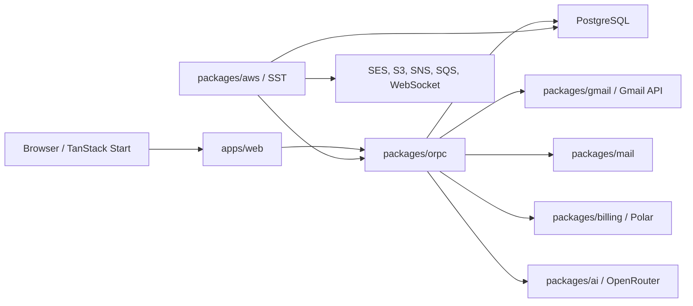

# Architecture

## System Overview

`apps/web` owns routing, rendering, browser state, server functions, and HTTP API handlers.
Database-backed business logic crosses through `packages/orpc`. Shared packages own provider and
domain-specific behavior.

## Workspace Boundaries

### `apps/web`

TanStack Start application containing:

- file-based routes and request handlers
- root providers and the HTML document
- mailbox, message, compose, chat, settings, auth, and legal features
- TanStack Query configuration and persisted caches
- consent-gated browser analytics

API handlers remain under `apps/web/src/routes/api/**`. Request-scoped auth and SSR data use route
loaders or TanStack Start server functions.

### `packages/orpc`

The application and database boundary. It owns:

- oRPC routers and authorization
- mailbox access resolution
- chat persistence and streaming orchestration
- Gmail credential encryption and refresh
- managed mailbox operations
- organization mail policy and usage
- billing-backed entitlements

No application module should bypass this package to query PostgreSQL.

### `packages/database`

Owns the Drizzle schema, client, migrations, schema-drift checks, and migration safety tooling.

### `packages/mail` and `packages/gmail`

`packages/mail` contains provider-independent mail behavior: schemas, MIME construction, raw parsing,
content extraction, draft anchors, and avatar derivation.

`packages/gmail` contains Gmail REST calls and Gmail-specific draft parsing. It does not own encrypted
credential storage or token refresh.

### Other Packages

- `packages/auth`: Better Auth setup, identity scopes, organizations, API keys, passkeys, and auth mail
- `packages/ui`: reusable Base UI-backed components
- `packages/ai`: model selection, prompts, classification, titles, and streamed generation
- `packages/aws`: SST handlers, mail ingestion, queues, workflows, and live synchronization
- `packages/billing`: plans, Polar checkout/webhooks, entitlements, and usage pricing
- `packages/env`: typed environment schemas and normalization
- `packages/deployment`: deployment helper scripts

## Identity and Mailboxes

Google sign-in and Gmail authorization are separate:

- Google sign-in requests identity scopes only.
- Gmail authorization uses a dedicated OAuth client, PKCE, and Gmail scopes.

Every connected Gmail account and managed address is a persisted mailbox with a stable generated ID.

- Gmail mailboxes remain private to their owner, even when placed in an organization.
- Managed mailboxes are organization-owned and visible only through explicit mailbox grants.
- Personal is always available but is not a Better Auth organization.
- `user.defaultMailboxId` is the global fallback across Personal and organizations.

Mailbox-scoped state, queries, caches, chats, compose sessions, and mutations must always include
`mailboxId`.

## Gmail Synchronization

The browser initially loads mailbox state through oRPC. Gmail REST work runs server-side.

Unfiltered mailbox views can apply Gmail history updates. Filtered search and Drafts refresh
manually. Foreground polling remains the reliability fallback.

For Pro mailboxes:

1. Gmail sends an authenticated notification to the stable SST ingress.
2. The ingress validates the Google identity and enqueues a mailbox job.
3. The worker reconciles Gmail history and updates persisted state.
4. Focused browser tabs receive a mailbox-dirty WebSocket signal and refresh immediately.
5. Scheduled maintenance renews watches and reconciles missed notifications.

The notification is a wake-up signal, not the source of truth.

## Managed Mail

SST owns standalone inbound and outbound mail infrastructure.

Inbound:

1. SES stores the raw message in S3.
2. SNS invokes the receipt processor.
3. The processor parses the MIME message and writes one row per exact managed recipient.
4. Untracked S3 objects are deleted.

Outbound:

- Managed compose and replies send through server-side mail logic.
- `POST /api/messages` authenticates an organization API key and requires a verified sender domain.
- Better Auth email hooks call the same endpoint.

## Chat

Chats are mailbox-scoped.

1. `chat.sendMessage` persists the user message, a run record, and a draft assistant row.
2. The browser opens the run SSE endpoint.
3. Server-side generation streams draft events and periodically persists the draft.
4. Disconnects can continue in-process or hand off to the SST queue/workflow.
5. Cancellation is cooperative through a persisted flag.

Historical chat state is loaded once through `chat.get`; the browser does not poll for generated
tokens.

## Consent and Observability

c15t runs in offline mode. Consent preferences stay in the browser and do not require an API route,
database tables, or migrations.

- PostHog and Speed Insights load only after `measurement` consent.
- Client Sentry remains enabled in production and is disclosed in the privacy policy.
- Signup acceptance of Terms and Privacy is separate from analytics consent.

## Billing

Billing subscriptions are user-scoped. Paid plans are `managed` and `pro`; Gmail and bring-your-own
key access do not require checkout.

PayKit and Polar handle product synchronization, checkout, subscription events, and usage events.
Organization mail usage is measured separately and billed according to plan-specific markup.

## Infrastructure Ownership

SST provisions the mail bucket, receipt topic and role, queues, workflows, function URLs, Gmail
notification ingress, live-sync WebSocket, and maintenance schedules.

Vercel hosts the web application. Production Git deployments are disabled; the manually approved
SST workflow synchronizes outputs and triggers the Vercel deploy hook.
