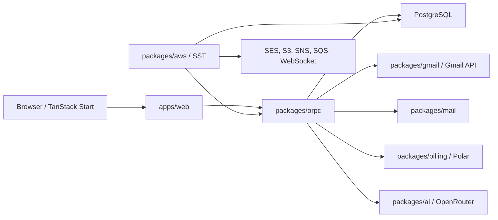

# Architecture

## System Overview

```mermaid
flowchart LR
  Browser["Browser / TanStack Start"] --> Web["apps/web"]
  Web --> ORPC["packages/orpc"]
  ORPC --> DB["PostgreSQL"]
  ORPC --> Gmail["packages/gmail / Gmail API"]
  ORPC --> Mail["packages/mail"]
  ORPC --> Billing["packages/billing / Polar"]
  ORPC --> AI["packages/ai / OpenRouter"]
  AWS["packages/aws / SST"] --> ORPC
  AWS --> DB
  AWS --> MailInfra["SES, S3, SNS, SQS, WebSocket"]
```

Behavior-producing AI agents share the scoped dynamic knowledge boundary in [`docs/ai-memory.md`](./ai-memory.md). Personal knowledge follows one user, mailbox knowledge follows the mailbox and is more specific, and all retrieval and mutation goes through `packages/orpc/src/ai-memory.ts`.

`apps/web` owns routing, rendering, browser state, server functions, and HTTP API handlers. Database-backed business logic crosses through `packages/orpc`. Shared packages own provider and domain-specific behavior.

## Workspace Boundaries

### `apps/web`

TanStack Start application containing:

- file-based routes and request handlers
- root providers and the HTML document
- mailbox, message, compose, chat, settings, auth, and legal features
- TanStack Query configuration and persisted caches
- consent-gated browser analytics

API handlers remain under `apps/web/src/routes/api/**`. Request-scoped auth and SSR data use route loaders or TanStack Start server functions.

### `packages/orpc`

The application and database boundary. It owns:

- oRPC routers and authorization
- mailbox access resolution
- chat persistence and streaming orchestration
- Gmail credential encryption and refresh
- managed mailbox operations
- organization mail policy and usage
- billing-backed entitlements

No application module should bypass this package to query PostgreSQL.

### `packages/database`

Owns the Drizzle schema, client, migrations, schema-drift checks, and migration safety tooling.

### `packages/mail` and `packages/gmail`

`packages/mail` contains provider-independent mail behavior: schemas, MIME construction, raw parsing, content extraction, draft anchors, and avatar derivation.

`packages/gmail` contains Gmail REST calls and Gmail-specific draft parsing. It does not own encrypted credential storage or token refresh.

### Other Packages

- `packages/auth`: Better Auth setup, identity scopes, organizations, API keys, passkeys, and auth mail
- `packages/ui`: reusable Base UI-backed components
- `packages/ai`: model selection, prompts, classification, titles, and streamed generation
- `packages/aws`: SST handlers, mail ingestion, queues, workflows, and live synchronization
- `packages/billing`: plans, Polar checkout/webhooks, entitlements, and usage pricing
- `packages/env`: typed environment schemas and normalization
- `packages/deployment`: deployment helper scripts

## Identity and Mailboxes

Google sign-in and Gmail authorization are separate:

- Google sign-in requests identity scopes only.
- Gmail authorization uses a dedicated OAuth client, PKCE, and Gmail scopes.

Every connected Gmail account and managed address is a persisted mailbox with a stable generated ID.

- Gmail mailboxes remain private to their owner, even when placed in an organization.
- Managed mailboxes are organization-owned and visible only through explicit mailbox grants.
- Personal is always available but is not a Better Auth organization.
- `user.defaultMailboxId` is the global fallback across Personal and organizations.

Mailbox-scoped state, queries, caches, chats, compose sessions, and mutations must always include `mailboxId`.

## Gmail Synchronization

The browser initially loads mailbox state through oRPC. Gmail REST work runs server-side.

Unfiltered mailbox views can apply Gmail history updates. Filtered search and Drafts refresh manually. Foreground polling remains the reliability fallback.

For Pro mailboxes:

1. Gmail sends an authenticated notification to the stable SST ingress.
2. The ingress validates the Google identity and enqueues a mailbox job.
3. The worker reconciles Gmail history and updates persisted state.
4. Focused browser tabs receive a mailbox-dirty WebSocket signal and refresh immediately.
5. Scheduled maintenance renews watches and reconciles missed notifications.

The notification is a wake-up signal, not the source of truth.

## Managed Mail

SST owns standalone inbound and outbound mail infrastructure.

Inbound:

1. SES stores the raw message in S3.
2. SNS invokes the receipt processor.
3. The processor parses the MIME message and writes one row per exact managed recipient.
4. Untracked S3 objects are deleted.

Outbound:

- Managed compose and replies send through server-side mail logic.
- `POST /api/v1/send` authenticates an organization API key and requires a verified sender domain.
- Better Auth email hooks call the same endpoint.

## Chat

Chats are mailbox-scoped. There is no cross-request resumability: each POST carries one turn, and a turn that is aborted or fails leaves no assistant row behind.

1. The AI SDK `useChat` hook posts to `POST /api/chat`, sending the mailbox context, selected model, and only the newest client message.
2. The server authorizes the mailbox-scoped thread, persists the user message, and rebuilds the canonical transcript from PostgreSQL; client-sent history is never trusted.
3. The AI SDK runs the model with Gmail, memory, Linear, calendar, and compose tools and streams its UI message protocol directly to the browser.
4. Tools that change state (`modify_mail`, `memory`, `linear_write`, `create_google_calendar_event`) require explicit user approval through the AI SDK's tool approval flow; a turn that ends on an approval prompt is persisted with its pending parts, so the decision can be validated server-side against what is actually pending.
5. `compose_email` is resolved entirely in the browser: the model proposes a draft, the user edits it in an inline composer, and the chosen Send/Save-draft/Decline outcome flows back as a client tool result.
6. Stopping or disconnecting mid-answer keeps whatever was generated so far: the server writes the partial assistant row when the stream ends. Failed generations persist nothing; reloading mid-answer shows the transcript including any partial answer.
7. Successful completion also refreshes billing usage and the chat title in the background. There is no streaming status column, generation lock, or cross-device polling: the composer disables itself locally while a request is in flight.

## Consent and Observability

c15t runs in offline mode. Consent preferences stay in the browser and do not require an API route, database tables, or migrations.

- PostHog and Speed Insights load only after `measurement` consent.
- Client Sentry remains enabled in production and is disclosed in the privacy policy.
- Signup acceptance of Terms and Privacy is separate from analytics consent.

## Billing

Billing subscriptions are user-scoped. Paid plans are `managed` and `pro`; Gmail and bring-your-own key access do not require checkout.

PayKit and Polar handle product synchronization, checkout, subscription events, and usage events. Organization mail usage is measured separately and billed according to plan-specific markup.

## Infrastructure Ownership

SST provisions the mail bucket, receipt topic and role, queues, workflows, function URLs, Gmail notification ingress, live-sync WebSocket, and maintenance schedules.

Cloudflare Workers hosts the web application. SST builds and publishes production and binds deployment outputs directly.

### SST configuration layout

The root [`sst.config.ts`](../sst.config.ts) owns only app-wide SST settings and delegates resource composition to [`infra/`](../infra):

- `stage.ts` centralizes stage flags, domains, and deployment environment names.
- `runtime.ts` normalizes `@quieter/env` values and shared Worker/function environment groups.
- `secrets.ts` declares stage-aware `sst.Secret` resources and Cloudflare secret bindings.
- `database.ts` owns the Cloudflare Hyperdrive binding.
- `web.ts` owns the TanStack Start Worker and its common bindings.
- `actions.ts` owns mailbox-action resources; chat generation runs in the web request through the AI SDK.
- `mail.ts` owns SES receipt storage, processing, ingress, and send permissions.
- `gmail.ts` owns Gmail live-sync and Pub/Sub resources across AWS and Cloudflare.
- `app.ts` is the small stage-aware composition entry point; `types.ts` contains shared infra boundary types.

SST is the runtime source of truth for application credentials and tokens; their canonical names live in `packages/env/src/sst-secrets.ts`. Cloudflare receives them as secret-text bindings, while AWS functions receive values derived from SST secret outputs. Deployment environment variables are reserved for non-secret configuration such as feature switches, resource identifiers, domains, and provider deployment credentials.
