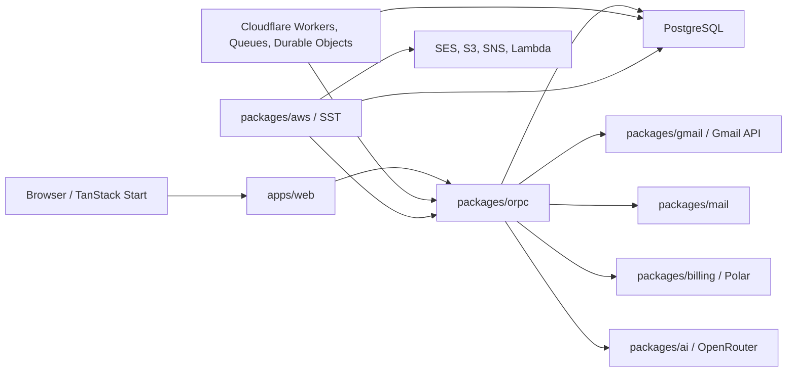

# Architecture

## System Overview

```mermaid
flowchart LR
  Browser["Browser / TanStack Start"] --> Web["apps/web"]
  Web --> ORPC["packages/orpc"]
  ORPC --> DB["PostgreSQL"]
  ORPC --> Gmail["packages/gmail / Gmail API"]
  ORPC --> Mail["packages/mail"]
  ORPC --> Billing["packages/billing / Polar"]
  ORPC --> AI["packages/ai / OpenRouter"]
  Cloudflare["Cloudflare Workers, Queues, Durable Objects"] --> ORPC
  AWS["packages/aws / SST"] --> ORPC
  Cloudflare --> DB
  AWS --> DB
  AWS --> MailInfra["SES, S3, SNS, Lambda"]
```

Behavior-producing AI agents share the scoped dynamic knowledge boundary in [`docs/ai-memory.md`](./ai-memory.md). Personal knowledge follows one user, mailbox knowledge follows the mailbox and is more specific, and all retrieval and mutation goes through `packages/orpc/src/ai-memory.ts`.

`apps/web` owns routing, rendering, browser state, server functions, and HTTP API handlers. Database-backed business logic crosses through `packages/orpc`. Shared packages own provider and domain-specific behavior.

## Workspace Boundaries

### `apps/web`

TanStack Start application containing:

- file-based routes and request handlers
- root providers and the HTML document
- mailbox, message, compose, chat, settings, auth, and legal features
- TanStack Query configuration and persisted caches
- consent-gated browser analytics

API handlers remain under `apps/web/src/routes/api/**`. Request-scoped auth and SSR data use route loaders or TanStack Start server functions.

### `packages/orpc`

The application and database boundary. It owns:

- oRPC routers and authorization
- mailbox access resolution
- chat persistence and streaming orchestration
- Gmail credential encryption and refresh
- managed mailbox operations
- organization mail policy and usage
- billing-backed entitlements

No application module should bypass this package to query PostgreSQL.

The mail router contains procedure registration, transport schemas and route metadata. Services under `packages/orpc/src/mail/` own queries, compose, labels and mutations, including provider selection and authorization. Shared Gmail request handling lives in `gmail-request.ts`; service modules do not import router bootstrapping. Feedback writes finish before request completion, with Gmail metadata reads processed in batches of four.

`vp run check:boundaries` checks imports with Oxc, including dynamic imports, re-exports, and type imports. It enforces package/application separation, application database and UI boundaries, and the AWS oRPC entrypoint allowlist. Computed dynamic imports are rejected because their targets cannot be checked. The only application database import allowed is `withRequestDatabaseClient` in the request bootstrap. CI runs this check alongside the AWS and Cloudflare handler bundles.

### `packages/database`

Owns the Drizzle schema, client, migrations, schema-drift checks, and migration safety tooling.

Every Worker invocation uses `withRequestDatabaseClient`; unscoped Worker database access throws. The same client remains available to nested calls and streamed response work. Cloudflare closes invocation sockets automatically, including Hyperdrive connections. Node processes reuse a bounded pool, with one connection in local development and five elsewhere; idle connections close after 20 seconds. See Cloudflare's [connection lifecycle](https://developers.cloudflare.com/hyperdrive/concepts/connection-lifecycle/) and documented [runtime detection](https://developers.cloudflare.com/workers/runtime-apis/web-standards/#navigatoruseragent).

Interactive write requests use database-backed rate limits. The minute dispatcher deletes up to 5,000 expired IP buckets per run, using the expiry index and skipping locked rows. The local `mail-recovery` trigger performs the same cleanup. During database failure, each isolate retains at most 1,000 fallback identities and rejects new identities at capacity until entries expire. Signed billing webhooks bypass the interactive login bucket and remain subject to their own signature validation. Read-only requests do not advertise a measured remaining allowance.

### `packages/mail` and `packages/gmail`

`packages/mail` owns shared message, attachment, label, category, and pagination contracts, along with MIME construction, raw parsing, content extraction, draft anchors, and avatar derivation. Both provider adapters return these contracts. The browser's mail helpers live in `apps/web/src/lib/mail.ts`; the web and AI packages have no direct Gmail-package dependency.

Managed saved views and rule conditions store stable label IDs. Definition writes hold shared locks on referenced labels until commit. Renaming or deleting a label locks it before repairing legacy name references and updating dependent definitions in the same transaction. Deletion disables affected views and rules without removing predicates or actions; the organizer explains the missing reference, and saving a repaired definition clears that reason. The nullable rule reason column is an additive migration and must precede the application release.

`packages/gmail` contains Gmail REST calls and Gmail-specific draft parsing. It does not own encrypted credential storage or token refresh.

The public SDK derives send inputs from `@quieter/mail/send` and validates responses with the shared delivery schemas. Its build bundles these contracts and permits only Zod and the optional React dependencies in emitted imports. `tsconfig.sdk.json` gives declaration generation a workspace-wide root so the published types include the shared contracts. React rendering lives in `quieter/react`; the core package has no React requirement.

### Other Packages

- `packages/auth`: Better Auth setup, identity scopes, organizations, API keys, passkeys, and auth mail
- `packages/ui`: reusable Base UI-backed components
- `packages/ai`: model selection, prompts, classification, titles, and streamed generation
- `packages/aws`: SES mail ingestion, delivery feedback, and AWS-specific handlers
- `packages/cloudflare`: Gmail notification ingress, queued synchronization, scheduled maintenance, and mailbox live synchronization
- `packages/billing`: plans, Polar checkout/webhooks, entitlements, and usage pricing
- `packages/env`: typed environment schemas and normalization
- `scripts`: SST deployment, local startup, environment checks, and release helpers
- `packages/deployment`: residual SST-generated binding declarations and their TypeScript configuration; no runtime or deployment scripts

## Identity and Mailboxes

Google sign-in and Gmail authorization are separate:

- Google sign-in requests identity scopes only.
- Gmail authorization uses a dedicated OAuth client, PKCE, and Gmail scopes.

Every connected Gmail account and managed address is a persisted mailbox with a stable generated ID.

- Gmail mailboxes remain private to their owner, even when placed in an organization.
- Shared managed mailboxes are organization-owned and visible only through explicit mailbox grants.
- Private managed mailboxes stay organization-owned for billing and domains but belong to one person: only the owner plus explicit member grants can access them, and division grants never apply.
- Private managed owners must remain team members. Offboarding revokes content and grant-management access; team admins can transfer ownership without reading mail.
- Creating a private mailbox, converting to private, or transferring its owner gives only the selected owner access. Conversion and transfer clear existing direct and division grants. Returning to shared preserves explicit member grants and never restores division access automatically. Configuration writes serialize with mode changes on the mailbox row.
- Account deletion requires transferring private managed mailboxes first. A separate restrictive `managedOwnerUserId` foreign key protects organization-owned mail; Gmail retains its existing account-deletion behavior.
- Personal is always available but is not a Better Auth organization.
- `user.defaultMailboxId` is the global fallback across Personal and organizations.

Mailbox-scoped state, queries, caches, chats, compose sessions, and mutations must always include `mailboxId`.

## Gmail Synchronization

The browser initially loads mailbox state through oRPC. Gmail REST work runs server-side.

Unfiltered mailbox views can apply Gmail history updates. Filtered search and Drafts refresh manually. Foreground polling remains the reliability fallback.

For Pro mailboxes:

1. Gmail sends an authenticated notification to the Cloudflare ingress.
2. The ingress validates the Google identity, notifies the mailbox Durable Object, and enqueues a mailbox job in Cloudflare Queues.
3. A Cloudflare queue consumer reconciles Gmail history through Hyperdrive and updates persisted state.
4. Focused browser tabs receive mailbox-dirty signals from the mailbox Durable Object and refresh immediately.
5. Scheduled maintenance on Cloudflare selects only mailboxes with due work: watch renewal (heartbeat plus expiry lookahead), first-time setup, or stale reconciliation for mailboxes with enabled automations.

The notification is a wake-up signal, not the source of truth.

## Managed Mail

SST owns standalone inbound and outbound mail infrastructure.

Inbound:

1. SES stores the raw message in S3.
2. SNS invokes the receipt processor.
3. The processor parses the MIME message and writes one row per exact managed recipient. Recipients that match no exact inbox fall through to the domain's whole-domain (catch-all) inbox when one is configured; one delivered message never produces duplicate rows for the same mailbox.
4. Untracked S3 objects are deleted.

Outbound:

- Managed compose and replies send through server-side mail logic.
- `POST /api/v1/send` authenticates an organization API key and requires a verified sender domain.
- Better Auth email hooks call the same endpoint.

## Chat

Chats are mailbox-scoped. There is no cross-request resumability: each POST carries one turn. A turn that fails leaves no assistant row behind; stopping or disconnecting mid-stream persists whatever was already generated.

1. The AI SDK `useChat` hook posts to `POST /api/chat`, sending the mailbox context, selected model, and only the newest client message.
2. The server authorizes the mailbox-scoped thread, persists the user message, and rebuilds the canonical transcript from PostgreSQL; client-sent history is never trusted.
3. The AI SDK runs the model with Gmail, memory, Linear, calendar, and compose tools and streams its UI message protocol directly to the browser.
4. Tools that change state (`modify_mail`, `memory`, `linear_write`, `create_google_calendar_event`) require explicit user approval through the AI SDK's tool approval flow; a turn that ends on an approval prompt is persisted with its pending parts, so the decision can be validated server-side against what is actually pending.
5. `compose_email` is resolved entirely in the browser: the model proposes a draft, the user edits it in an inline composer, and the chosen Send/Save-draft/Decline outcome flows back as a client tool result.
6. Cancelling before any content arrived leaves no row. Once content has streamed, stopping the answer or disconnecting persists the partial assistant row when the stream ends, so reloads show what was generated. Failed generations persist nothing; their truncated output is indistinguishable from a broken answer.
7. Successful completion also refreshes billing usage and the chat title in the background. There is no streaming status column, generation lock, or cross-device polling: the composer disables itself locally while a request is in flight.

## Consent and Observability

c15t runs in offline mode. Consent preferences stay in the browser and do not require an API route, database tables, or migrations.

- PostHog and Speed Insights load only after `measurement` consent.
- Client Sentry remains enabled in production and is disclosed in the privacy policy.
- Server-side unexpected failures from the web worker, all Cloudflare background workers, and AWS functions are reported to Sentry; expected user and authorization states are filtered before capture.
- Signup acceptance of Terms and Privacy is separate from analytics consent.

## Billing

Billing subscriptions belong to teams. Paid plans are `managed` and `pro`. A subscription grants access only while active or trialing and before its current period ends.

Polar handles checkout, renewals, and subscription events. Signed webhooks synchronize subscription status, period dates, and scheduled cancellation. Billing reads reconcile stale records after five minutes, including active and past-due subscriptions, to recover from missed events. Equal provider timestamps can refresh the reconciliation time; older timestamps cannot overwrite newer subscription state. A failed reconciliation returns an unavailable state and retries after five minutes. Checkout refreshes the existing subscription before deciding whether a new checkout is allowed, preventing duplicate subscriptions after a missed renewal.

Canceling at period end preserves access until the period ends. Immediate cancellation, expiry, or past-due status pauses sending, API access, and paid configuration changes. Domains, keys, inboxes, and existing messages are retained. Billing management and authorized deletion remain available. Incoming mail continues for configured inboxes; cancellation does not delete receipt rules or silently discard accepted messages. Full inbound suspension, sender rejection, and a retention deadline are not implemented. Receiving and storage can therefore still incur costs after cancellation.

The additive `cancelAtPeriodEnd` migration must run through the protected migration workflow before deploying code that reads the column. It defaults to false for existing records and is refreshed from Polar on the next reconciliation. No production migration is run from a local checkout.

For private production testing, a 100% subscription discount must cover every intended billing cycle. Check its duration and the discount attached to the affected subscription in Polar. Merchant verification and subscription status are separate; do not bypass production billing checks based on an unverified merchant account. An active subscription with a past period end stays paused until the provider advances the period. Extending access against the old period would also omit new usage from its credit window. See [billing operations](./billing.md) for production setup and renewal troubleshooting. Organization mail usage is measured separately and billed according to plan-specific markup.

## Infrastructure Ownership

Managed mail rules store the matching decision, definition, and completed actions before forwarding. Forwarding uses the send coordinator outside the rule transaction, with a stable identity per action. Ingestion retries resume the stored definition even after a rule edit; explicitly applying an edited rule to existing messages creates a new revision. Historical attempts with uncertain delivery require review.

Historical rule runs advance through the existing per-minute dispatcher, independently of status polling. Each job stores its definition and checks its lease and running status before updating progress. Cancellation prevents further messages and progress writes; an already executing message can finish. A failure retains the cursor and diagnostic. Running the same rule revision again resumes the failed job. Local execution uses `vp run dev:trigger mail-recovery`.

Apply the additive rule migrations `20260907172554_thankful_alex_power` and `20260907211509_abnormal_amphibian` before releasing these changes. Drain older ingestion and rule workers before enabling the new execution path because they do not understand the stored action decisions. Keep the historical application table during this transition.

SST provisions both providers. AWS owns the SES receipt bucket, receipt topic and role, and mail-processing functions. Cloudflare owns Gmail notification ingress, queueing, scheduled maintenance, and live-sync Durable Objects.

Cloudflare Workers hosts the web application. SST builds and publishes production and binds deployment outputs directly.

### SST configuration layout

The root [`sst.config.ts`](../sst.config.ts) owns only app-wide SST settings and delegates resource composition to [`infra/`](../infra):

- `stage.ts` centralizes stage flags, domains, and deployment environment names.
- `runtime.ts` normalizes `@quieter/env` values and shared Worker/function environment groups.
- `secrets.ts` declares stage-aware `sst.Secret` resources and Cloudflare secret bindings.
- `database.ts` owns the Cloudflare Hyperdrive binding.
- `web.ts` owns the TanStack Start Worker and its common bindings.
- Mailbox actions execute asynchronously from their persisted runs: Gmail sync and maintenance dispatch new runs straight onto Cloudflare Queues, while a per-minute fallback cron atomically claims SES-ingested, lost, or crashed runs before dispatching them. Transient execution failures stay retryable until the queue's final delivery settles the run as failed.
- Connector writes persist their planned arguments and an input hash before execution. Successful results are reusable even without an external object ID. Changed arguments, legacy effects without a plan, and ambiguous provider outcomes stop the run for review instead of repeating a write. Effect identities include the branch's edge path, so separate visits to a node do not collide. Merge nodes support pass-through only; legacy `wait_all` configurations must be corrected before publishing or running.
- Action execution remains on Queues with sequential graph traversal. Each attempt has a four-minute deadline, 45-second model/tool steps, a renewed 90-second ownership lease, and a six-attempt ceiling across queue redeliveries. Database transitions and external-write claims check the attempt generation. Completed step results include their selected output ports and variables, so retries reuse decisions. Frame records remain readable for old runs; new execution does not write them. Dispatch claims at most 100 runs per tick.
- The cleanup keeps this restricted engine instead of adding Workflows alongside existing run storage. [Cloudflare Workflows](https://developers.cloudflare.com/workflows/reference/limits/) supports durable steps and longer lifetimes, but completed state retention is 30 days on paid plans and external-effect reconciliation would still need our database. [Local Workflows execution](https://developers.cloudflare.com/workflows/build/local-development/) is supported by Wrangler. Reconsider that migration if actions need durable sleeps, human waits, or longer execution; do not add those semantics to this engine. No deployed Workflows comparison was performed in this cleanup.
- Apply `20260907212421_slim_ricochet` before the revised executor and drain old workers. Legacy completed steps without replay results require review rather than generating new decisions. This additive transition preserves historical run readers.
- Apply `20260907144353_redundant_typhoid_mary` before deploying the effect guard. Pause dispatch and drain old action workers before activating it: older workers do not understand incomplete effect records. Existing completed effect records remain intact; an old partially executed run may require review. The migration only adds nullable columns and permits missing external IDs.
- `mail.ts` owns SES receipt storage, processing, ingress, and send permissions.
- `gmail.ts` owns Gmail live-sync and Pub/Sub resources on Cloudflare.
- `app.ts` is the small stage-aware composition entry point; `types.ts` contains shared infra boundary types.

SST is the runtime source of truth for application credentials and tokens; their canonical names live in `packages/env/src/sst-secrets.ts`. Cloudflare receives them as secret-text bindings, while AWS functions receive values derived from SST secret outputs. Deployment environment variables are reserved for non-secret configuration such as feature switches, resource identifiers, domains, and provider deployment credentials.
