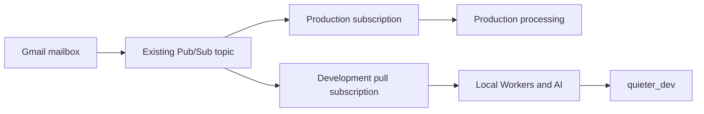

# Development integration plan

This document records the development architecture and ownership rules. Startup commands are in [Development](development.md); provider research, verified setup and remaining acceptance work are in [Service audit](development-services.md).

## Service choices

| System | Normal development choice | Additional testing |
| --- | --- | --- |
| PlanetScale | Existing `quieter_dev` logical database on the current production cluster, with separate app and migrator roles | Disposable database only for destructive migration tests, preferably the existing CI job |
| Cloudflare | Native Vite/workerd runtime for the web app and background Workers, with local queues and Durable Objects | Deployed development checks for cloud-specific behavior |
| SST | Development-stage Secrets, linked bindings, and native development process management | AWS Lambda Live against explicitly selected development resources |
| Gmail/Pub/Sub | Shared-account observation mode, own development subscription, one watch owner | Dedicated mailbox or exclusive ownership handoff for provider writes |
| AI | Separate OpenRouter development key with a small spending cap; development Workers AI credentials for embeddings | Native AI SDK fixtures for repeatable failure/stream tests |
| Polar | Existing sandbox, with sandbox credentials, products, and local webhook forwarding | Turn billing bypass off for entitlement and checkout acceptance tests |
| Sentry/PostHog | Disabled by default; useful local logs remain enabled | Explicit development-project opt-in and privacy/network assertions |
| c15t | Existing offline consent behavior | Test accept, reject, revoke, persistence, and script gating |
| logo.dev | Real API with development configuration | Fixtures for unavailable/missing image cases |
| Domain Connect | Inactive, not a setup prerequisite | Reassess secret wiring and a test domain when activating it |

An additional paid PlanetScale branch/cluster and a permanently running local PostgreSQL server are outside this plan. Share the current cluster deliberately: modest connection pools and worker concurrency, bounded queries, and no load testing or cluster-wide changes as part of routine development. A logical database separates application data, but a runaway development query can still consume shared capacity.

The development database needs the current committed schema, including pgvector for semantic AI memory. Reconcile the existing migration ledger before applying changes. Do not rewrite migration checksums or reset the shared database to bypass a mismatch. Existing destructive integration tests require a disposable target; keep them in CI when no disposable local target is available, and report them as unrun locally rather than claiming coverage.

## Shared Gmail accounts

Production and development can read the same Gmail mailbox while keeping their application data separate. They cannot treat Gmail itself as separate state. Changing a label, marking a message read, updating a draft, sending mail, or running an automation affects the same external account.

The existing mailbox-processing leases and action-run claims live in each application's database. They coordinate consumers within one environment but cannot prevent two environments from performing the same external action. Separate OAuth credentials do not solve that problem.

Google's `users.watch` API sets up or updates a watch and requires its topic to belong to the requesting Google project. Avoid relying on undocumented assumptions about independent watches for different clients in the same project. Keep one designated owner for watch creation, renewal, and stopping. See [Gmail watch](https://developers.google.com/workspace/gmail/api/reference/rest/v1/users/watch).

### Default shared-account mode

Use the current watch owner's topic with an additional development subscription:

A separate subscription provides development its own delivery and acknowledgment state. Do not attach a local consumer to the production subscription: consumers on the same subscription share delivery work. Google supports both pull and push subscriptions. See [Pub/Sub subscription behavior](https://docs.cloud.google.com/pubsub/docs/subscription-overview).

Prefer a development pull subscription for everyday local work. It requires outbound connectivity and subscriber credentials, without a public tunnel. A small local bridge should feed the same validated business-processing entrypoint used by the Worker. It must not manufacture Google OIDC tokens or weaken the public push endpoint's verification. Keep the authenticated push path for a separate integration test using a development push subscription and HTTPS tunnel.

Controls required for this mode:

- Production remains the watch owner. Development does not call Gmail watch/stop, including from maintenance, disconnect, billing changes, or error recovery.
- The local subscriber only processes mailboxes explicitly connected and allowlisted in development. Unrelated notifications must not trigger message retrieval or AI calls.
- Development maintains its own history cursor, deduplication, processing leases, and local queue state. It acknowledges only its own subscription.
- Real AI may summarize, extract information, classify, and store results in `quieter_dev`. Proposed provider actions are recorded for inspection rather than executed.
- Enforce the read-only provider boundary server-side for shared mailboxes. Include manual mail mutations, auto-label application, drafts, send, trash/delete, archive/read state, watch management, and connector tool writes. A hidden button or a disabled cron is insufficient.
- Use development billing configuration. Development AI usage must not update production entitlements or report usage to production Polar.
- Bound catch-up work after the laptop has been offline. Collapse redundant mailbox notifications and cap AI work so a backlog cannot exhaust the development credit budget.

This is development observation of a shared mailbox, not a frozen snapshot: production changes can still appear in later reads. Deterministic fixtures remain useful for reproducing a particular message state.

### Full mutation testing

For tests that must really send, label, modify drafts, or run connector actions, use a dedicated test mailbox or explicitly transfer processing ownership for the shared mailbox. A handoff needs to pause production selection and writes for that mailbox, account for in-flight work and queued retries, verify the pause, enable development writes, and later reconcile history before restoring production ownership.

The current code has no cross-environment ownership mechanism. Do not implement the handoff as two unrelated flags in separate databases and assume that is atomic. Start with an explicit verified operational handoff or a dedicated test mailbox; add a shared ownership/fencing mechanism only if automated handoffs become necessary. Stopping a local terminal does not pause deployed production processing.

Calendar and Linear have the same shared-external-state issue. Use test resources for write tests or explicitly include those actions in the ownership policy.

## Secrets and local environment

SST Secrets should be the preferred persistent store for development credentials. Keep them in an explicit development stage and link only the values each runtime needs. The value can arrive as a process environment variable or Worker secret binding at runtime; that is compatible with SST being its source of truth. Continue reading configuration through `@quieter/env`. See [SST Secrets](https://sst.dev/docs/component/secret/) and [local linking](https://sst.dev/docs/linking/).

Use separate development values for auth signing, encryption, OpenRouter, Polar sandbox, live-sync signing, and other provider access. Do not use production secret fallbacks to satisfy missing development configuration. Preserve the production database guard across every bootstrap, including injected SST configuration. Keep the migrator credential in a migration-command context rather than link it into the web app or background Workers.

Ignored `.env.local` remains acceptable for settings and necessary local credentials while linking is completed. Non-secret settings include stage selection, loopback URLs, feature switches, and the allowlisted database hostname. AWS SSO and CLI credential storage bootstrap access to SST; they need not become long-lived AWS keys in the app's environment file.

An SST secret name by itself is not enough: declare it, link it to the intended runtime, map it through the existing environment bootstrap, and verify presence without printing the value. Offline execution without SST connectivity would require a local cache or fixtures; always-offline execution is not a requirement for this setup.

Agents may read and move secrets between the approved local configuration and the intended provider as needed for the task. Keep them out of source control, shell command history, logs, browser screenshots, and user-facing reports. Obtain user participation only when an account login, consent, ownership decision, or protected operation requires it; complete independent work meanwhile.

## Native tooling to wire

Cloudflare's installed Vite plugin supports `auxiliaryWorkers`, persistent state, and development tunnels. Wire the realtime Worker, Gmail queue consumer, Gmail maintenance handler, mailbox-action consumer, and action dispatcher alongside the web Worker. Keep the shared-mailbox restrictions above active even when all handlers run locally. Use scheduled-event injection for tests and an explicit scheduler when continuous local maintenance is needed. See [multiple Workers](https://developers.cloudflare.com/workers/local-development/multi-workers/).

Use Cloudflare Local Explorer and the runtime inspector for local state, requests, and errors. Its API/UI already provides inspection; avoid building a replacement developer dashboard. Keep these tools on loopback when exposing selected app routes for webhooks. See [Local Explorer](https://developers.cloudflare.com/workers/local-development/local-explorer/).

Correct SST frontend startup ownership and set its dev command to Vite+. Verify generated links reach the actual web process. Keep separate development storage and managed-mail resource configuration for the SES path. The shared PlanetScale choice does not authorize shared production mail mutations or cloud deployment changes.

## Implementation status, September 5, 2026

The database has all 59 committed migrations and pgvector 0.8.5. It was backed up before applying forward migrations; two historical checksum differences were preserved rather than rewritten. No paid branch or cluster was created.

Native background queues, Durable Objects, signed realtime connections, manual scheduler triggers and the separate Pub/Sub pull bridge are implemented. The bridge uses `quieter-gmail-local-leander`; production retains its existing watch and subscription. Gmail/Calendar/Linear provider writes default to blocked. Gmail writes additionally require resolving the access token's mailbox against the explicit account allowlist.

The `local-leander` SST store contains development secrets for the app, database, OAuth, encryption, AI and Polar. Real OpenRouter generation, Workers AI embeddings and native Polar CLI webhook delivery have passed connected smoke tests. Polar uses a non-expiring sandbox token. Telemetry has an explicit local opt-in and remains disabled by default.

Managed mail still needs dedicated development R2/AWS resources, an isolated test domain and a reviewed SES receipt routing arrangement. The legacy `dev:mail` command evaluates the full infrastructure and is not the normal local entrypoint. Deployed concurrency, IAM, real incoming MX routing and full provider mutation acceptance remain separate checks.

Sentry/PostHog opt-in checks, c15t coverage, and disposable migration tests remain part of targeted verification. Domain Connect is deferred until used. A change is complete only when the affected local feature can be started, exercised, and debugged, or an exact external blocker is recorded with the required user action.
