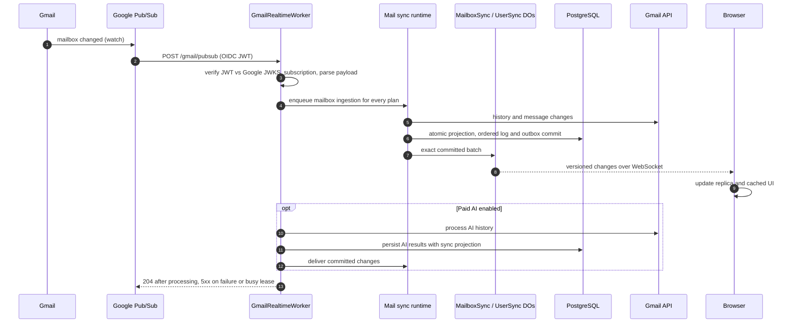
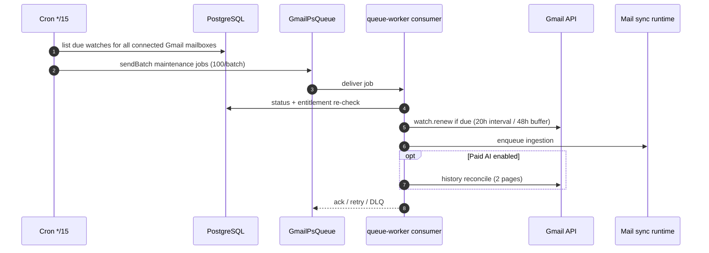
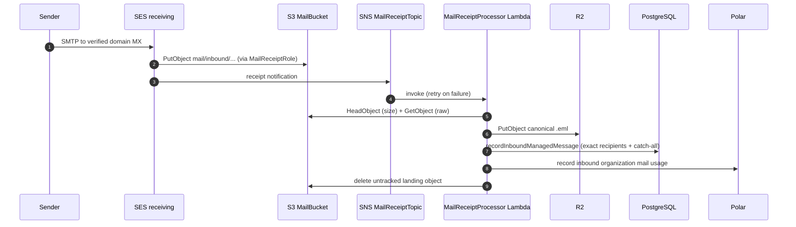
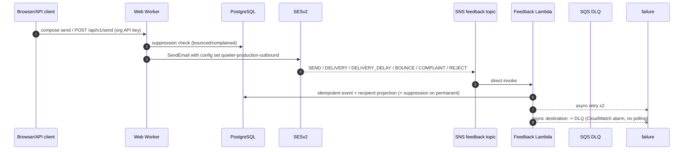

# Infrastructure Map

Complete map of Quieter's infrastructure as defined by `sst.config.ts` and `infra/`. It reflects the Cloudflare background-job architecture and direct Gmail notification processing.

Two providers, one rule: **Cloudflare runs the application and background jobs; AWS runs managed-email transport (SES) plus the temporary receipt bucket. PostgreSQL is the single source of truth.**

## Master Diagram

```mermaid
flowchart TB
    subgraph USER["Users"]
        BROWSER["Browser<br/>TanStack Start app + TanStack Query"]
    end

    subgraph CF["Cloudflare"]
        direction TB
        subgraph EDGE["Edge / HTTP"]
            WEB["Web Worker<br/>sst: TanStack Start<br/>quieter.email + www<br/>SSR, oRPC, /api/chat,<br/>/api/v1/send, auth, Polar webhooks"]
            GWORKER["GmailRealtimeWorker<br/>/gmail/pubsub (POST)"]
            SYNC["Mail sync Worker<br/>authorized WebSockets, delivery and recovery"]
        end

        subgraph DO["Durable Objects"]
            MDO["MailboxSync<br/>job coalescing + subscribers"]
            UDO["UserSync<br/>one per user<br/>hibernatable multiplexed sockets"]
        end

        subgraph QUEUES["Cloudflare Queues"]
            PSQ["GmailPsQueue<br/>retry 10 / 30s delay<br/>maxConcurrency 20"]
            PSD["GmailPsDlq"]
            SYNCQ["Mail sync queue + DLQ"]
        end

        subgraph CONSUMERS["Queue consumers + crons (Workers)"]
            PSW["queue-worker.ts<br/>Gmail sync + maintenance<br/>cpu limit 5 min"]
            MMAINT["Cron every minute<br/>mail-maintenance-worker.ts<br/>send recovery, cleanup, rule backfills"]
            PSMAINT["Cron */15 min<br/>gmail-maintenance-worker.ts<br/>selects only due mailboxes"]
        end

        HD["Hyperdrive AppDatabaseV2<br/>connection pooling, caching off"]
        R2["R2 bucket<br/>canonical raw mail<br/>mail/inbound/**"]
        BODIES["Mail sync R2<br/>immutable content-addressed bodies"]
        CFLOG["Workers observability<br/>logs 100% / traces 1%"]
    end

    subgraph AWS["AWS eu-central-1 (managed mail only)"]
        direction TB
        SESIN["SES receiving<br/>receipt rule set quieter-mail"]
        S3["S3 MailBucket<br/>mail/inbound/*<br/>lifecycle: expire after 1 day"]
        SNIN["SNS MailReceiptTopic"]
        RECEIPT["Lambda MailReceiptProcessor<br/>receipt.handler, 30s"]
        INGRESS["Lambda MailIngress + Function URL<br/>inbound.handler, 30s, bearer token"]
        SESOUT["SES sending v2<br/>config set quieter-production-outbound"]
        SNOUT["SNS MailOutboundFeedbackTopic"]
        FEED["Lambda MailOutboundFeedbackProcessor<br/>outbound-feedback.handler, 60s<br/>async retries 2"]
        FDLQ["SQS MailOutboundFeedbackDeadLetterQueue<br/>14-day retention, no consumer"]
        ALARM["CloudWatch DLQ alarm"]
        IAM["IAM: MailReceiptRole, per-Lambda roles,<br/>WebAwsPermissions ses:SendEmail for Web"]
    end

    subgraph EXT["External services"]
        PG[("PostgreSQL<br/>single source of truth<br/>Drizzle schema")]
        GPUB["Google Pub/Sub<br/>Gmail watch push"]
        GAPI["Gmail API<br/>history, messages, labels, watch, modify"]
        GOAUTH["Google Identity OAuth<br/>sign-in only"]
        OR["OpenRouter<br/>chat, auto-label, useful details,<br/>titles"]
        POLAR["Polar<br/>products, checkout, webhooks, usage"]
        LINEAR["Linear<br/>OAuth + MCP"]
        GCAL["Google Calendar<br/>OAuth + events"]
        SENTRY["Sentry<br/>web, background workers, AWS Lambda"]
        PH["PostHog EU + c15t consent<br/>browser, consent-gated"]
    end

    BROWSER -->|HTTPS SSR / oRPC / chat stream| WEB
    BROWSER <-.->|authenticated WebSocket| UDO
    GPUB -->|OIDC JWT push| GWORKER
    GWORKER -->|enqueue ingestion| SYNC
    GWORKER -->|AI processing| HD
    SYNC --> MDO
    MDO --> SYNCQ
    SYNCQ --> SYNC
    SYNC -->|transactional projection + log + outbox| HD
    SYNC --> BODIES
    MDO -->|committed batch| UDO
    PSQ --> PSW
    PSW -->|process + maintain| HD
    PSW -->|enqueue ingestion| SYNC
    PSMAINT -->|list connected mailboxes| HD
    PSMAINT -->|maintenance jobs| PSQ
    PSQ --> PSD
    MMAINT --> HD
    MMAINT --> R2
    MMAINT --> POLAR
    MMAINT --> SENTRY
    WEB --> HD
    RECEIPT -->|canonical raw .eml| R2
    INGRESS -->|canonical raw .eml| R2
    WEB -->|SendEmail / SendRawEmail| SESOUT
    SESIN -->|raw message| S3
    SESIN -->|receipt event| SNIN
    SNIN --> RECEIPT
    RECEIPT -->|DATABASE_URL direct| PG
    RECEIPT -->|batch after commit| SYNC
    INGRESS --> PG
    SESOUT -->|delivery events| SNOUT
    SNOUT -->|direct invoke| FEED
    FEED -->|onFailure after retries| FDLQ
    FDLQ --> ALARM
    FEED --> PG
    WEB --> GAPI
    PSW --> GAPI
    BROWSER -->|Google sign-in| GOAUTH
    PSW --> OR
    WEB --> OR
    WEB --> POLAR
    RECEIPT --> POLAR
    WEB --> LINEAR
    WEB --> GCAL
    WEB --> SENTRY
    GWORKER --> SENTRY
    PSW --> SENTRY
    RECEIPT --> SENTRY
    FEED --> SENTRY
    BROWSER -->|after consent| PH
    HD --> PG
    WEB -->|object reads via S3 API| R2
```

## Runtime Pieces

### Cloudflare

| Resource | SST type | Entry point | Triggered by | Talks to | Notes |
| --- | --- | --- | --- | --- | --- |
| `Web` | `sst.cloudflare.TanStackStart` | `apps/web` | Browser HTTPS | Hyperdrive, SESv2, Gmail API, OpenRouter, Polar, Sentry, R2 | Production domain `quieter.email` (+ `www` redirect), logs + traces on, linked scoped AWS credentials via `WebAwsPermissions` for `ses:SendEmail`/`SendRawEmail`. |
| `GmailRealtimeWorker` | `sst.cloudflare.Worker` | `packages/cloudflare/src/worker.ts` | Google Pub/Sub push, POST `/gmail/pubsub` | Hyperdrive, processing secrets, sync runtime | Verifies Google OIDC JWT, subscription name and 64 KiB body limit. Enqueues ingestion for every plan and processes paid AI before acknowledging. Failures and busy processing return a retryable error. |
| `MailSyncWorker` | `sst.cloudflare.Worker` | `packages/sync-worker/src/worker.ts` | WebSockets, committed batches, queue, scheduled maintenance | Hyperdrive, sync DOs, queue and R2 | Dedicated provider-neutral transport, recovery, command processing and collection. See `infra/sync.ts` for resource names and bindings. |
| `UserSync` / `MailboxSync` | SQLite Durable Objects | `packages/sync-worker/src/user-sync.ts`, `mailbox-sync.ts` | Authorized user connections and mailbox jobs | User sockets and subscriber routing | One logical user object per user and mailbox object per mailbox. Objects hibernate; they are not permanently running processes. |
| `GmailPsQueue` / `GmailPsDlq` | `sst.cloudflare.Queue` | — | Producer: maintenance cron | Consumer `queue-worker.ts` | DLQ after 10 retries, 30 s retry delay, max concurrency 20, batch size 1. |
| `queue-worker.ts` consumer | Worker queue subscription | `packages/cloudflare/src/queue-worker.ts` | `GmailPsQueue` messages | Hyperdrive, Gmail API, OpenRouter, Polar, sync runtime | Handles watch maintenance and notification jobs with retries on busy processing leases. |
| `GmailPubSubMaintenance` | `sst.cloudflare.Cron` | `packages/cloudflare/src/gmail-maintenance-worker.ts` | `*/15 * * * *` | Hyperdrive, `GmailPsQueue` | Selects up to 500 connected mailboxes with missing or expiring watches, or renewal overdue at 20 hours plus hash jitter. Error backoff is one hour. Live sync is available on all plans. |
| `MailMaintenance` | `sst.cloudflare.Cron` | `packages/cloudflare/src/mail-maintenance-worker.ts` | every minute | Hyperdrive, R2, Polar, Sentry | Send recovery, storage cleanup, expired rate-limit cleanup, and managed rule backfills. |
| `AppDatabaseV2` | `sst.cloudflare.Hyperdrive` | — | Worker DB access | PostgreSQL origin from `DatabaseUrl` secret | Caching disabled; production uses fixed Hyperdrive id. Workers use `withRequestDatabaseClient` per invocation. |
| R2 bucket (external) | configured via `R2_*` env + access-key secrets, not an SST resource | — | Receipt processor, mail ingress | — | Canonical `.eml` storage under `mail/inbound/yyyy/mm/dd/uuid.eml`, read back by the web worker via S3-compatible API. |

### AWS (eu-central-1)

| Resource | SST type | Entry point | Triggered by | Talks to | Notes |
| --- | --- | --- | --- | --- | --- |
| `MailBucket` | `sst.aws.Bucket` | — | SES receipt rule | Receipt processor | Bucket policy restricts `s3:PutObject` to `ses.amazonaws.com` with source-account and receipt-rule ARN conditions; lifecycle expires `mail/inbound/*` after 1 day. |
| `MailReceiptTopic` | `sst.aws.SnsTopic` | — | SES receipt notifications | `MailReceiptProcessor` Lambda | Topic policy allows SES publish from the account. |
| `MailReceiptRole` | IAM role | — | SES receipt rule | S3, SNS | Assumed by `ses.amazonaws.com` under receipt-rule conditions; least-privilege PutObject/Publish. |
| `MailReceiptProcessor` | `sst.aws.Function` (SNS subscription) | `packages/aws/src/receipt.handler` | SNS message | S3 (Head/Get), R2, PostgreSQL, Polar, Sentry | Parses MIME, writes one row per exact managed recipient with catch-all fallback, records usage, deletes untracked S3 objects. |
| `MailIngress` | `sst.aws.Function` + Function URL | `packages/aws/src/inbound.handler` | Authenticated POST (`MailIngestToken`) | R2 or S3, PostgreSQL | Non-SES ingestion path (same pipeline as receipts). |
| `MailOutboundConfigurationSet` | `aws.sesv2.ConfigurationSet` | — | Every send via SESv2 | `MailOutboundFeedbackTopic` | Publishes SEND, DELIVERY, DELIVERY_DELAY, BOUNCE, COMPLAINT, REJECT. Reputation metrics on, account suppression for bounce/complaint. Open/click tracking off. |
| `MailOutboundFeedbackTopic` | `sst.aws.SnsTopic` | — | SES event destination | Direct Lambda subscription | — |
| `MailOutboundFeedbackProcessor` | `sst.aws.Function` (SNS subscription) | `packages/aws/src/outbound-feedback.handler` | SNS direct invoke | PostgreSQL, Sentry | 60 s timeout, 2 async retries, validates topic ARN, idempotent event writes, recipient projection, suppression on permanent bounce/complaint. |
| `MailOutboundFeedbackDeadLetterQueue` | `sst.aws.Queue` | — | Lambda async failure destination | CloudWatch alarm | 14-day retention, deliberately no consumer, so it generates no polling traffic. |
| Receipt rule set `quieter-mail` | managed by app code via `MAIL_RECEIPT_*` env | — | Per verified domain | SES receiving | Wires sender domains to bucket + topic + role. |

### Data stores

| Store | Owner | Contents | Lifetime |
| --- | --- | --- | --- |
| PostgreSQL | external, via `DatabaseUrl` secret | Everything: users, orgs, mailboxes, messages metadata, chats, retained legacy action records, credentials (encrypted), watch state, entitlements, delivery feedback, suppressions | Permanent; migrations via `packages/database` |
| R2 | Cloudflare, referenced not provisioned | Canonical raw `.eml` objects for managed mail | Indefinite; deleted only when untracked by the ingestion transaction |
| S3 `MailBucket` | AWS | SES landing copies only | 1-day lifecycle + eager delete after processing |
| Durable Object storage | `UserSync`, `MailboxSync` | Socket attachments, subscriber leases and job coalescing | Bounded operational state; durable source of mail state remains PostgreSQL |
| R2 sync bodies | `infra/sync.ts` | Immutable HTML/text bodies addressed by SHA-256 | Collected after 30 days only when no current or retained replay references remain |
| Browser IndexedDB | User-scoped sync engine | Metadata, checkpoints, compressed bodies, pending commands and separate draft recovery | Bounded cache, revoked access and logout purge private state |

## Key Flows

### 1. Gmail real-time sync

### 2. Gmail scheduled maintenance (every 15 minutes)

### 3. Inbound managed mail

Alternate ingestion: authenticated `POST` to the `MailIngress` Function URL (bearer `MailIngestToken`) performs the same store-record-usage pipeline for non-SES sources.

### 4. Outbound managed mail + delivery feedback

### 5. Mail maintenance

`infra/mail-maintenance.ts` provisions `MailMaintenance` every minute. Its handler, `packages/cloudflare/src/mail-maintenance-worker.ts`, runs send recovery, storage cleanup, rate-limit cleanup, and managed rule backfills within a request-scoped database client. The local `vp run dev:trigger mail-recovery` command invokes the same maintenance operations. Managed inbox rules remain supported; custom actions are no longer created or executed by the new application.

### 6. Chat with tools

Browser `useChat` streams one turn to `POST /api/chat` on the Web Worker. The worker authorizes the mailbox-scoped thread, rebuilds the transcript from PostgreSQL, runs the AI SDK against OpenRouter with Gmail/memory/Linear/calendar tools, streams the UI protocol back, and persists the assistant row on completion. State-changing tools require the AI SDK approval flow; `compose_email` resolves entirely in the browser.

## Configuration Plumbing

Rules enforced by `AGENTS.md`: sensitive values only through SST Secrets and linked bindings; `DATABASE_URL` and `MAIL_INGEST_TOKEN` never become Cloudflare bindings; `wrangler.types.jsonc` holds test-only fixtures for type generation, never real configuration.

## Recently Removed (this branch) and Cleanup Pending

Removed from the graph: AWS Gmail SQS queues + FIFO DLQ, `GmailPubSubIngress` API Gateway, `GmailPubSubProcess` Function URL, EventBridge maintenance cron, `MailboxActionQueue` SQS + consumer Lambda, DynamoDB `GmailLiveSyncConnections`, API Gateway WebSocket live-sync, outbound-feedback primary SQS queue and its age alarm, and the `@aws-sdk/client-sqs`/DynamoDB/ApigatewayManagementAPI dependencies.

Because production uses `removal: "retain"`, these still exist in AWS until manually deleted: `quieter-production-GmailPubSubQueueQueue-*.fifo`, `GmailPubSubDeadLetterQueueQueue-*.fifo`, `MailboxActionQueueQueue-*`, `MailboxActionDeadLetterQueueQueue-*`, `MailOutboundFeedbackQueueQueue-*`, the old `MailOutboundFeedbackDeadLetterQueueQueue-*` (superseded by the new one only after deploy), the orphaned dev `quieter-mail-dev-ChatGenerationQueueQueue-*` with its poller (214k idle polls/month on its own), the DynamoDB table, the API Gateway WebSocket API, and the old Gmail Pub/Sub Lambdas and ingress. Drain `MailOutboundFeedbackQueue` before deleting it; delete replaced Gmail resources only after their Cloudflare replacements have handled production traffic. Custom action resources have no replacement consumer and require the retirement procedure below.

Custom action Cloudflare queues, their consumer, and the dispatcher are also removed from the infrastructure definition. This has not been deployed. Pause old dispatch and producers, drain in-flight workers, and account for queued retries before removing those resources. Confirm no retained worker can resume action execution. Keep the existing action database tables and records unchanged during the rollback window; their deletion requires a later contract migration. Connectors and chat remain active. See [release requirements](architecture.md#custom-action-removal-and-release).
