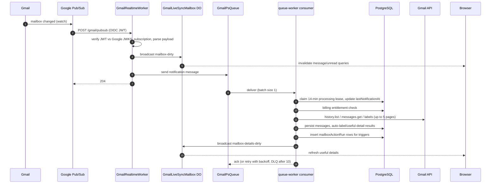
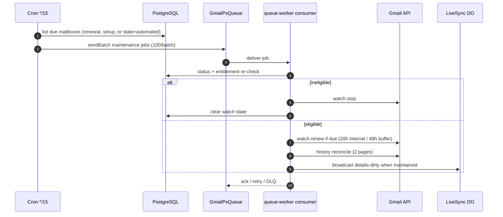
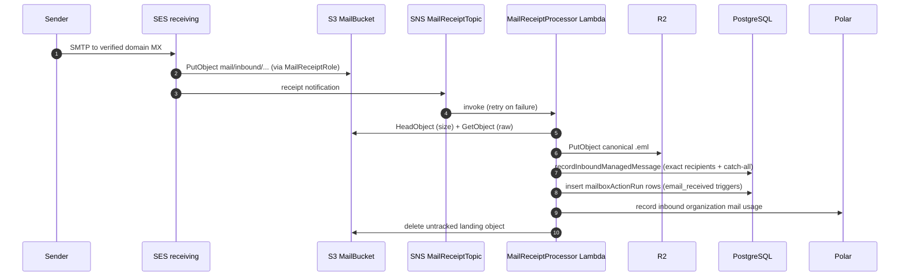
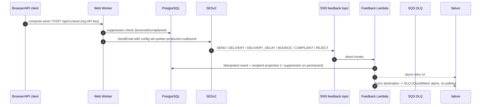
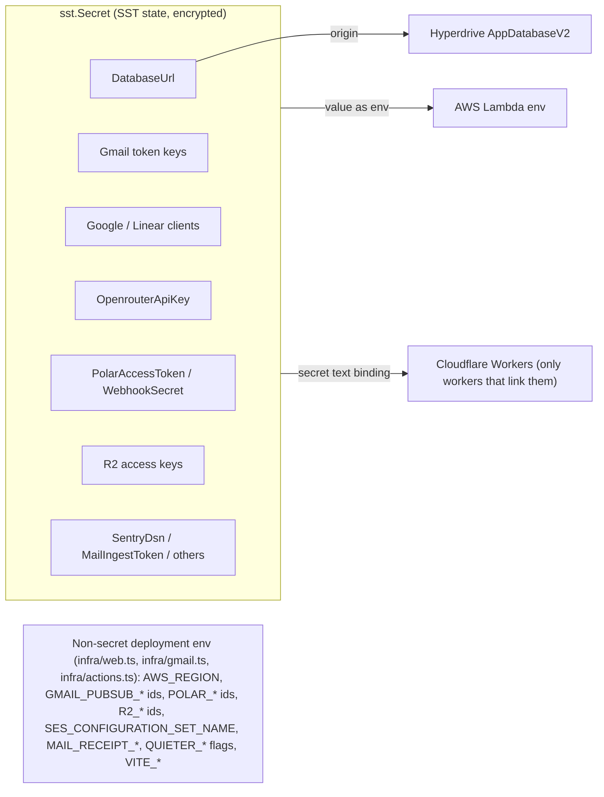

# Infrastructure Map

Complete map of Quieter's infrastructure as defined by `sst.config.ts` and `infra/`. It reflects the Cloudflare-first background-job architecture on `feat/cloudflare-background-jobs`; production still runs the previous AWS topology until that branch is deployed and the orphaned queues noted at the bottom are cleaned up.

Two providers, one rule: **Cloudflare runs the application and background jobs; AWS runs managed-email transport (SES) plus the temporary receipt bucket. PostgreSQL is the single source of truth.**

## Master Diagram

```mermaid
flowchart TB
    subgraph USER["Users"]
        BROWSER["Browser<br/>TanStack Start app + TanStack Query"]
    end

    subgraph CF["Cloudflare"]
        direction TB
        subgraph EDGE["Edge / HTTP"]
            WEB["Web Worker<br/>sst: TanStack Start<br/>quieter.email + www<br/>SSR, oRPC, /api/chat,<br/>/api/v1/send, auth, Polar webhooks"]
            GWORKER["GmailRealtimeWorker<br/>/gmail/pubsub (POST)<br/>/gmail/live (WebSocket)"]
        end

        subgraph DO["Durable Objects"]
            LSDO["GmailLiveSyncMailbox<br/>one per email address<br/>hibernatable WebSockets + /broadcast"]
        end

        subgraph QUEUES["Cloudflare Queues"]
            PSQ["GmailPsQueue<br/>retry 10 / 30s delay<br/>maxConcurrency 20"]
            PSD["GmailPsDlq"]
            MAQ["MailboxActionQueue<br/>retry 5 / 30s delay<br/>maxConcurrency 5"]
            MAD["MailboxActionDeadLetterQueue"]
        end

        subgraph CONSUMERS["Queue consumers + crons (Workers)"]
            PSW["queue-worker.ts<br/>Gmail sync + maintenance<br/>cpu limit 5 min"]
            MAW["mailbox-action-worker.ts<br/>runs mailbox automations<br/>cpu limit 5 min"]
            PSMAINT["Cron */15 min<br/>gmail-maintenance-worker.ts<br/>selects only due mailboxes"]
            MADISP["Cron every minute<br/>mailbox-action-dispatch-worker.ts"]
        end

        HD["Hyperdrive AppDatabaseV2<br/>connection pooling, caching off"]
        R2["R2 bucket<br/>canonical raw mail<br/>mail/inbound/**"]
        CFLOG["Workers observability<br/>logs 100% / traces 1%"]
    end

    subgraph AWS["AWS eu-central-1 (managed mail only)"]
        direction TB
        SESIN["SES receiving<br/>receipt rule set quieter-mail"]
        S3["S3 MailBucket<br/>mail/inbound/*<br/>lifecycle: expire after 1 day"]
        SNIN["SNS MailReceiptTopic"]
        RECEIPT["Lambda MailReceiptProcessor<br/>receipt.handler, 30s"]
        INGRESS["Lambda MailIngress + Function URL<br/>inbound.handler, 30s, bearer token"]
        SESOUT["SES sending v2<br/>config set quieter-production-outbound"]
        SNOUT["SNS MailOutboundFeedbackTopic"]
        FEED["Lambda MailOutboundFeedbackProcessor<br/>outbound-feedback.handler, 60s<br/>async retries 2"]
        FDLQ["SQS MailOutboundFeedbackDeadLetterQueue<br/>14-day retention, no consumer"]
        ALARM["CloudWatch DLQ alarm"]
        IAM["IAM: MailReceiptRole, per-Lambda roles,<br/>WebAwsPermissions ses:SendEmail for Web"]
    end

    subgraph EXT["External services"]
        PG[("PostgreSQL<br/>single source of truth<br/>Drizzle schema")]
        GPUB["Google Pub/Sub<br/>Gmail watch push"]
        GAPI["Gmail API<br/>history, messages, labels, watch, modify"]
        GOAUTH["Google Identity OAuth<br/>sign-in only"]
        OR["OpenRouter<br/>chat, auto-label, useful details,<br/>action conditions, titles"]
        POLAR["Polar<br/>products, checkout, webhooks, usage"]
        LINEAR["Linear<br/>OAuth + MCP"]
        GCAL["Google Calendar<br/>OAuth + events"]
        SENTRY["Sentry<br/>web + AWS Lambda"]
        PH["PostHog EU + c15t consent<br/>browser, consent-gated"]
    end

    BROWSER -->|HTTPS SSR / oRPC / chat stream| WEB
    BROWSER <-.->|wss /gmail/live?token| GWORKER
    GPUB -->|OIDC JWT push| GWORKER
    GWORKER -->|mailbox-dirty| LSDO
    GWORKER -->|enqueue notification| PSQ
    LSDO -.->|refresh signal| BROWSER
    PSQ --> PSW
    PSW -->|process + maintain| HD
    PSW -->|details-dirty broadcast| LSDO
    PSMAINT -->|list connected mailboxes| HD
    PSMAINT -->|maintenance jobs| PSQ
    PSQ --> PSD
    MADISP -->|queued or lease-expired runs| HD
    MADISP -->|runId| MAQ
    MAQ --> MAW
    MAQ --> MAD
    MAW --> HD
    WEB --> HD
    RECEIPT -->|canonical raw .eml| R2
    INGRESS -->|canonical raw .eml| R2
    WEB -->|SendEmail / SendRawEmail| SESOUT
    SESIN -->|raw message| S3
    SESIN -->|receipt event| SNIN
    SNIN --> RECEIPT
    RECEIPT -->|DATABASE_URL direct| PG
    INGRESS --> PG
    SESOUT -->|delivery events| SNOUT
    SNOUT -->|direct invoke| FEED
    FEED -->|onFailure after retries| FDLQ
    FDLQ --> ALARM
    FEED --> PG
    WEB --> GAPI
    PSW --> GAPI
    MAW --> GAPI
    BROWSER -->|Google sign-in| GOAUTH
    PSW --> OR
    MAW --> OR
    WEB --> OR
    WEB --> POLAR
    RECEIPT --> POLAR
    MAW --> POLAR
    PSW --> LINEAR
    MAW --> LINEAR
    WEB --> GCAL
    MAW --> GCAL
    WEB --> SENTRY
    RECEIPT --> SENTRY
    FEED --> SENTRY
    BROWSER -->|after consent| PH
    HD --> PG
    WEB -->|object reads via S3 API| R2
```



## Runtime Pieces

### Cloudflare

| Resource | SST type | Entry point | Triggered by | Talks to | Notes |
| --- | --- | --- | --- | --- | --- |
| `Web` | `sst.cloudflare.TanStackStart` | `apps/web` | Browser HTTPS | Hyperdrive, SESv2, Gmail API, OpenRouter, Polar, Sentry, R2 | Production domain `quieter.email` (+ `www` redirect), logs + traces on, linked scoped AWS credentials via `WebAwsPermissions` for `ses:SendEmail`/`SendRawEmail`. |
| `GmailRealtimeWorker` | `sst.cloudflare.Worker` | `packages/cloudflare/src/worker.ts` | Google Pub/Sub push (POST `/gmail/pubsub`), browser WebSocket (`/gmail/live`) | `GmailLiveSyncMailbox`, `GmailPsQueue` | Verifies Google OIDC JWT against JWKS, checks subscription name, body limit 64 KiB. One DO per normalized email address. |
| `GmailLiveSyncMailbox` | `sst.cloudflare.DurableObject` (SQLite, migration `v1`) | `packages/cloudflare/src/gmail-live-sync-mailbox.ts` | Worker fetch / WS upgrade | Browser sockets, workers via `/broadcast` | Hibernatable WebSockets, auto ping/pong, broadcasts `mailbox-dirty` and `mailbox-details-dirty`. |
| `GmailPsQueue` / `GmailPsDlq` | `sst.cloudflare.Queue` | — | Producer: realtime worker, maintenance cron | Consumer `queue-worker.ts` | DLQ after 10 retries, 30 s retry delay, max concurrency 20, batch size 1. |
| `queue-worker.ts` consumer | Worker (queue subscription) | `packages/cloudflare/src/queue-worker.ts` | `GmailPsQueue` messages | Hyperdrive, Gmail API, OpenRouter, Polar, DO | Handles `notification` and `maintenance` messages; 5-minute CPU limit; per-message `retry` with exponential backoff, throws on busy mailbox lease. |
| `GmailPubSubMaintenance` | `sst.cloudflare.Cron` | `packages/cloudflare/src/gmail-maintenance-worker.ts` | `*/15 * * * *` | Hyperdrive, `GmailPsQueue` | Due-driven selection (≤500/tick, ordered by soonest expiry): watch state missing, expiry within 72 h, renewal heartbeat overdue (36 h + hash jitter), stale reconciliation (2 h + jitter) for mailboxes with enabled automations, or recent error backoff (1 h). Mailboxes receiving pushes stay fresh via `lastReconciledAt` and are never selected. |
| `MailboxActionQueue` / `MailboxActionDeadLetterQueue` | `sst.cloudflare.Queue` | — | Producer: dispatch cron | Consumer `mailbox-action-worker.ts` | DLQ after 5 retries, 30 s delay, max concurrency 5, batch size 1. |
| `mailbox-action-worker.ts` consumer | Worker (queue subscription) | `packages/cloudflare/src/mailbox-action-worker.ts` | `MailboxActionQueue` messages | Hyperdrive, Gmail API, OpenRouter, Polar, Linear, Google Calendar | Executes `mailboxActionRun` by id; 5-minute CPU limit. |
| `MailboxActionDispatch` | `sst.cloudflare.Cron` | `packages/cloudflare/src/mailbox-action-dispatch-worker.ts` | every minute | Hyperdrive, `MailboxActionQueue` | Fallback dispatcher: Gmail-synced runs are enqueued directly by the sync consumer, so the cron only covers SES-ingested runs, lost messages, and hard-crash recovery (runs `running` with an expired 10-min lease). Failed runs are marked `failed` and never re-dispatched. |
| `AppDatabaseV2` | `sst.cloudflare.Hyperdrive` | — | Worker DB access | PostgreSQL origin from `DatabaseUrl` secret | Caching disabled; production uses fixed Hyperdrive id. Workers use `withRequestDatabaseClient` per invocation. |
| R2 bucket (external) | configured via `R2_*` env + access-key secrets, not an SST resource | — | Receipt processor, mail ingress | — | Canonical `.eml` storage under `mail/inbound/yyyy/mm/dd/uuid.eml`, read back by the web worker via S3-compatible API. |

### AWS (eu-central-1)

| Resource | SST type | Entry point | Triggered by | Talks to | Notes |
| --- | --- | --- | --- | --- | --- |
| `MailBucket` | `sst.aws.Bucket` | — | SES receipt rule | Receipt processor | Bucket policy restricts `s3:PutObject` to `ses.amazonaws.com` with source-account and receipt-rule ARN conditions; lifecycle expires `mail/inbound/*` after 1 day. |
| `MailReceiptTopic` | `sst.aws.SnsTopic` | — | SES receipt notifications | `MailReceiptProcessor` Lambda | Topic policy allows SES publish from the account. |
| `MailReceiptRole` | IAM role | — | SES receipt rule | S3, SNS | Assumed by `ses.amazonaws.com` under receipt-rule conditions; least-privilege PutObject/Publish. |
| `MailReceiptProcessor` | `sst.aws.Function` (SNS subscription) | `packages/aws/src/receipt.handler` | SNS message | S3 (Head/Get), R2, PostgreSQL, Polar, Sentry | Parses MIME, writes one row per exact managed recipient with catch-all fallback, records usage, deletes untracked S3 objects. |
| `MailIngress` | `sst.aws.Function` + Function URL | `packages/aws/src/inbound.handler` | Authenticated POST (`MailIngestToken`) | R2 or S3, PostgreSQL | Non-SES ingestion path (same pipeline as receipts). |
| `MailOutboundConfigurationSet` | `aws.sesv2.ConfigurationSet` | — | Every send via SESv2 | `MailOutboundFeedbackTopic` | Publishes SEND, DELIVERY, DELIVERY_DELAY, BOUNCE, COMPLAINT, REJECT. Reputation metrics on, account suppression for bounce/complaint. Open/click tracking off. |
| `MailOutboundFeedbackTopic` | `sst.aws.SnsTopic` | — | SES event destination | Direct Lambda subscription | — |
| `MailOutboundFeedbackProcessor` | `sst.aws.Function` (SNS subscription) | `packages/aws/src/outbound-feedback.handler` | SNS direct invoke | PostgreSQL, Sentry | 60 s timeout, 2 async retries, validates topic ARN, idempotent event writes, recipient projection, suppression on permanent bounce/complaint. |
| `MailOutboundFeedbackDeadLetterQueue` | `sst.aws.Queue` | — | Lambda async failure destination | CloudWatch alarm | 14-day retention, deliberately no consumer, so it generates no polling traffic. |
| Receipt rule set `quieter-mail` | managed by app code via `MAIL_RECEIPT_*` env | — | Per verified domain | SES receiving | Wires sender domains to bucket + topic + role. |

### Data stores

| Store | Owner | Contents | Lifetime |
| --- | --- | --- | --- |
| PostgreSQL | external, via `DatabaseUrl` secret | Everything: users, orgs, mailboxes, messages metadata, chats, action graphs/runs, credentials (encrypted), watch state, entitlements, delivery feedback, suppressions | Permanent; migrations via `packages/database` |
| R2 | Cloudflare, referenced not provisioned | Canonical raw `.eml` objects for managed mail | Indefinite; deleted only when untracked by the ingestion transaction |
| S3 `MailBucket` | AWS | SES landing copies only | 1-day lifecycle + eager delete after processing |
| Durable Object storage | `GmailLiveSyncMailbox` | Live socket tags only | Ephemeral |

## Key Flows

### 1. Gmail real-time sync



### 2. Gmail scheduled maintenance (every 15 minutes)



### 3. Inbound managed mail



Alternate ingestion: authenticated `POST` to the `MailIngress` Function URL (bearer `MailIngestToken`) performs the same store-record-usage pipeline for non-SES sources.

### 4. Outbound managed mail + delivery feedback



### 5. Mailbox automations

```mermaid
sequenceDiagram
    autonumber
    participant GS as Gmail sync consumer
    participant IN as SES ingestion Lambda
    participant DB as PostgreSQL
    participant Q as MailboxActionQueue
    participant W as mailbox-action-worker
    participant AI as OpenRouter
    participant EX as Linear / Google Calendar / Gmail

    GS->>DB: insert mailboxActionRun rows
    GS->>Q: sendBatch runIds immediately (instant)
    IN->>DB: insert mailboxActionRun rows (no queue access)
    participant CR as Dispatch cron (1 min, fallback)
    Note over Q: dispatch cron covers SES-ingested runs and crash recovery
    CR->>DB: list queued + lease-expired runs
    CR->>Q: sendBatch runIds
    Q->>W: deliver runId
    W->>DB: claim run (10-min lease)
    W->>DB: load graph, message content, AI memory
    W->>AI: condition / router / agent steps
    W->>EX: connector + Gmail effects (idempotency keys)
    W->>DB: persist frames, step runs, effects; mark failed with lastError on failure
    W-->>Q: ack / retry with backoff / DLQ after 5
```

### 6. Chat with tools

Browser `useChat` streams one turn to `POST /api/chat` on the Web Worker. The worker authorizes the mailbox-scoped thread, rebuilds the transcript from PostgreSQL, runs the AI SDK against OpenRouter with Gmail/memory/Linear/calendar tools, streams the UI protocol back, and persists the assistant row on completion. State-changing tools require the AI SDK approval flow; `compose_email` resolves entirely in the browser.

## Configuration Plumbing



Rules enforced by `AGENTS.md`: sensitive values only through SST Secrets and linked bindings; `DATABASE_URL` and `MAIL_INGEST_TOKEN` never become Cloudflare bindings; `wrangler.types.jsonc` holds test-only fixtures for type generation, never real configuration.

## Recently Removed (this branch) and Cleanup Pending

Removed from the graph: AWS Gmail SQS queues + FIFO DLQ, `GmailPubSubIngress` API Gateway, `GmailPubSubProcess` Function URL, EventBridge maintenance cron, `MailboxActionQueue` SQS + consumer Lambda, DynamoDB `GmailLiveSyncConnections`, API Gateway WebSocket live-sync, outbound-feedback primary SQS queue and its age alarm, and the `@aws-sdk/client-sqs`/DynamoDB/ApigatewayManagementAPI dependencies.

Because production uses `removal: "retain"`, these still exist in AWS until manually deleted: `quieter-production-GmailPubSubQueueQueue-*.fifo`, `GmailPubSubDeadLetterQueueQueue-*.fifo`, `MailboxActionQueueQueue-*`, `MailboxActionDeadLetterQueueQueue-*`, `MailOutboundFeedbackQueueQueue-*`, the old `MailOutboundFeedbackDeadLetterQueueQueue-*` (superseded by the new one only after deploy), the orphaned dev `quieter-mail-dev-ChatGenerationQueueQueue-*` with its poller (214k idle polls/month on its own), the DynamoDB table, the API Gateway WebSocket API, and the old Gmail Pub/Sub Lambdas and ingress. Drain `MailOutboundFeedbackQueue` before deleting it; delete the others only after the replacement Cloudflare queues have handled production traffic.
