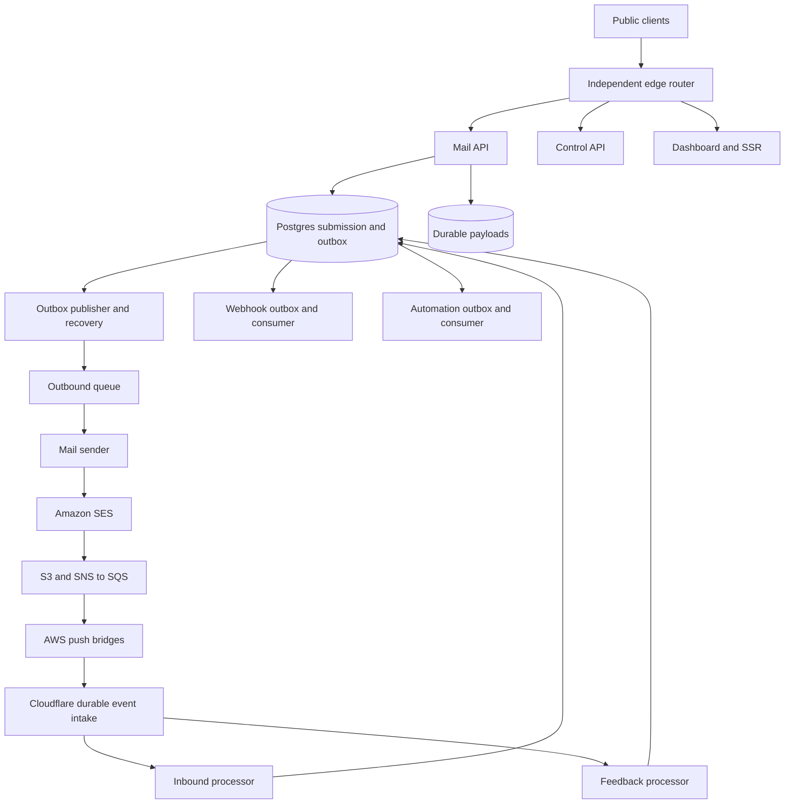

# Mail platform reliability and deployment plan

## Status and scope

Revised and approved for implementation on 2026-09-06. Implementation is in progress, beginning with milestone A. The guarantees below are acceptance criteria, not claims about the current production deployment.

The review covers PR #269 at `8dc34e281097d8866f1e84e0e247257eca94cede`, its existing local plan edits, and `origin/main` at `d01467d84594ed819a17b04a2f18afaa6c789577`. Production account settings and provider failure behavior have not been verified by this document review. Repository definitions show intended configuration, not necessarily deployed state.

Keep the deliberate scope of the refactor:

- Cloudflare runs application and mail business logic. AWS provides SES and the storage, buffering, IAM, and small push adapters needed around it.
- Mail acceptance, sending, inbound processing, feedback, webhooks, automation, Gmail, the control API, and the frontend have independent runtime release boundaries.
- Merging a compatible runtime change to `main` ships automatically. Build once, test before activation, promote directly to 100%, then check health. Routine releases have no percentage ladder or manual service-by-service ceremony.
- Rollback uses retained provider versions, not a rebuild, an old SST deployment, or a Git force-push.
- SST remains the authority for infrastructure and application secrets. Use linked bindings and service bindings where supported.
- No acknowledged submission disappears because of an application crash, queue expiry, deployment, or rollback. Provider disaster recovery has a separate, explicit durability boundary.
- The internal own-fault availability aspiration remains 99.999%. It is not an external SLA or a prerequisite for beginning the work. Measure customer-visible availability including dependency failures alongside that internal measure.

This plan does not authorize production migrations, resource transfers, credential changes, deployments, or paid provisioning. Those remain protected implementation operations under `AGENTS.md`.

## Audit decisions

| Finding | Change to the plan |
| --- | --- |
| A failed cross-provider SST operation can already have changed live resources. | Record actual provider state and recover partial runtime promotion. Repair infrastructure separately. |
| Deployment safety was postponed until phases 7 and 8 of the mail migration. | Deliver release recovery and immutable web promotion first. |
| Post-deploy asset archiving leaves a live release incompletely archived. A same-run rebuild may change bytes under the same build ID. | Archive the exact tested candidate before activation. Repair uploads without rebuilding or redeploying. |
| The control plane was the public router despite the promise that mail survives control-plane failures. | Use a separate minimal `edge-router`. Its mail route never invokes dashboard/control API code. Acknowledge it as a shared dependency. |
| SST and native commands could both own active code and traffic. | Assign one writer per provider field and prove the ownership transfer before enabling native releases. |
| A final rollback step cannot run after its runner dies. A lost response does not prove a provider mutation failed. | Persist intent before mutation and reconcile outside the original run. |
| Selecting each service's last healthy version can construct an incompatible release. | Store a complete service-version map and compatibility graph. Restore the affected dependency group in a valid order. |
| Preview URLs and version overrides were treated as interchangeable isolated environments. | Protect previews, acknowledge real bindings, and test background triggers separately. Overrides do not target arbitrary inactive uploads. |
| A ban on polling strands a committed outbox if its wakeup is lost. | Use immediate wakeups plus a bounded indexed recovery sweep. Avoid busy loops and full-table scans. |
| RPO 0 was asserted from a PostgreSQL commit alone. | Verify actual database failover and payload durability before extending the application-failure guarantee to provider failure. |
| Stable RFC Message-ID and leases were implied to prevent SES duplicates. | Persist attempts, correlate feedback, and quarantine ambiguous attempts. Neither leases nor Message-ID fence SES. |
| Async success would change today's `messageId` and `sent: true` semantics. | Introduce a versioned async contract and migrate existing clients explicitly. |
| Phase 1 acknowledged queued mail before phase 2 supplied a sender. | Keep async acceptance disabled until dispatcher, sender, and recovery are operational. |
| Several risk descriptions predate merged Gmail, action retry, delivery, and local-development changes. | Start from current implementations and tests rather than recreating obsolete paths. |
| Splitting SST state was treated as necessary for runtime isolation. | Separate mutation ownership first. Split state only for a proven operational benefit. |

## Repository evidence

Inspect these again at implementation start because `main` continues to change:

- `.github/workflows/sst-deploy.yml` runs migrations before one SST deployment. At the audited `origin/main`, routine deployment copies `CloudflareAccountId`, `CloudflareAiApiToken`, `DatabaseUrl`, and `PolarWebhookSecret` into SST. The PR branch has a different fourth secret. Preserve the recent billing-binding fix while removing duplicate secret authorities.
- `.github/workflows/ci-main.yml` builds the web Worker as a check but does not hand that artifact to deployment. A passing build does not certify the separately built release.
- `scripts/archive-web-assets.ts` in #269 uploads after SST deployment and deletes a release marker before repair. `scripts/verify-web-asset-archive.ts` checks a marker/build ID, not a complete content manifest. Preflight limits damage from the next release but does not recover the failed current release.
- `docs/deployment.md` claims a failed production deployment leaves the previous Worker serving traffic. Correct this in the first implementation PR. SST does not make AWS, Cloudflare, and PostgreSQL one transaction.
- `packages/orpc/src/organization-mail.ts` holds the organization usage lock across SES submission and persists response/projections afterward. Its successful response contains SES's `messageId` and `sent: true`. Provider success followed by persistence failure remains ambiguous.
- `packages/cloudflare/src/worker-utils.ts` already processes Gmail notifications through Cloudflare. `packages/cloudflare/src/mailbox-action-worker.ts` already retries and passes final-attempt policy to the executor. Preserve these fixes and inspect remaining recovery gaps.
- `infra/mail.ts` has direct SNS-to-Lambda receipt/feedback processing. Feedback has a Lambda failure destination in SQS, not a primary SQS capture buffer. S3 landing objects expire after one day.
- `packages/orpc/src/organization-mail-delivery.ts` and its tests now implement delivery events, suppression, and audit history. Extend them with submission/attempt correlation rather than building a competing model.
- PR #278 introduced the explicit reload dialog. Preserve that UX when integrating asset retention; do not restore #269's older automatic reload behavior.
- PR #276 added secret-linked local runtimes and fixture mailboxes. Extend that setup and current `AGENTS.md` isolation rules.

The locally installed Cloudflare Pulumi package is `6.15.0`, matching `sst.config.ts`. It contains `WorkerVersion` and `WorkersDeployment`. SST's generated `cloudflare/worker.ts` still constructs `WorkersScript` and resolves linked values into bindings. SDK resources existing does not prove that TanStack assets, bindings, triggers, retention, and SST ownership work together correctly. Prove that early in a development stage.

## Guarantees and limits

### Release guarantees

1. Build, test, archive, and candidate-smoke failures do not activate the candidate.
2. Live versions and release records remain identifiable after every interruption.
3. A partial runtime release is deliberately completed or compensated to a compatible healthy state. Some services updating does not mean the release succeeded.
4. Rollback changes only eligible runtime versions. It cannot undo database writes, sent messages, secret revocation, resource deletion, or incompatible Durable Object changes.
5. Dashboard-only changes cannot change mail runtime versions or require dashboard availability for mail traffic.
6. A stale alarm or resumed job cannot silently replace a newer release.
7. Recovery never depends on rebuilding historical application source.

Pre-activation tests reduce exposure; they cannot prove the absence of production bugs. Direct-to-100% promotion intentionally permits a short regression interval before detection and recovery. Do not promise that a broken version can never receive a request.

### Submission durability

The async acceptance boundary is a confirmed PostgreSQL transaction containing submission, idempotency result, usage reservation, and outbox event. Every referenced body/attachment must already exist durably with a verified checksum.

The application-failure objective is zero loss of acknowledged submissions while the authoritative database and payload objects remain intact. Keep nonterminal work recoverable beyond queue retention. Queues and DLQs are not the permanent ledger.

Before claiming RPO 0 through provider failure, verify actual PlanetScale topology, acknowledged-write replication/failover semantics, backup recovery point, and payload-store guarantees. Multi-AZ deployment alone is insufficient evidence. If those guarantees do not cover the desired failure model, select a stronger storage design or narrow the objective explicitly. Do not silently add a second nontransactional acceptance ledger. PITR alone does not establish RPO 0.

[PlanetScale architecture](https://planetscale.com/docs/postgres/postgres-architecture) and [replica behavior](https://planetscale.com/docs/postgres/scaling/replicas) describe the platform; account configuration still needs read-only verification.

### Availability and overload

Define eligible public requests, numerator, denominator, deadline, and exclusion rules. Measure customer-visible availability including provider failures. Track own-fault attribution separately. Missing telemetry and unknown causes remain unknown, not successes or automatically excluded incidents.

Measure acceptance latency, unpublished outbox age, accepted-to-SES lag, inbound lag, webhook lag, drain capacity, and recovery duration separately. Set customer SLOs from evidence; release gates still need concrete pass/fail rules from their first deployment.

Acceptance depends on PostgreSQL and, for external payloads, R2. Set finite tenant/global pending-work, payload-size, storage-cost, and oldest-backlog limits. Reject new work before commit with a documented retryable response when capacity is exhausted. Preserve already accepted work. An SES outage must not produce unbounded acceptance costs.

## Runtime architecture



### Deployable registry

| Deployable | Responsibility | Release and permission boundary |
| --- | --- | --- |
| `edge-router` | Same-origin routing through service bindings | Independent shared ingress, no database or product auth logic |
| `mail-api` | Submission and status contracts | Database acceptance and payload storage, no SES/dashboard dependency |
| `mail-sender` | Durable attempts and SES submission | Own queue/DLQ, SES send permission, bounded concurrency |
| `mail-inbound` | Canonical MIME, parsing, mailbox persistence | Own intake/queue/DLQ and replay, no sender permission |
| `mail-events` | SES correlation, delivery events, suppression | Own intake/queue/DLQ, existing delivery contracts |
| `mail-webhooks` | Signed customer delivery and replay | Own queue/DLQ and controlled external HTTP access |
| `mail-automation` | Mailbox rules, AI, connector effects | Own queue/DLQ and credentials, lower priority than transport |
| `control-api` | Auth, oRPC, settings, domain/billing configuration | Independent backend, supported frontend contracts |
| `control-plane-web` | TanStack Start UI and necessary SSR | Own code/assets; any BFF affects dashboard traffic only |
| `gmail` | Existing ingress, sync, maintenance, realtime Workers | Preserve existing separate triggers/versions and explicit Durable Object lifecycle |
| `aws-inbound-bridge` | SQS receipt handoff | Published Lambda versions, stable alias, scoped queue/target permissions |
| `aws-feedback-bridge` | SQS feedback handoff | Independent alias, retry capacity, backlog |

The outbox publisher has a dedicated background entrypoint, trigger, and release record. It can share a workload's deployment initially but cannot live in a dashboard request or depend on that request remaining alive. Isolate publisher capacity where sender reliability requires it.

`mail-foundation` describes durable infrastructure ownership, not another runtime. A folder or SST application is not automatically a useful failure boundary.

### Routing and access

Preserve the current origin and paths. A separate minimal `edge-router` forwards public mail API paths to `mail-api`, control API paths to `control-api`, and frontend traffic to `control-plane-web`. Backing Workers use service bindings and disable public `workers.dev` access except explicitly protected operational previews.

The router must not import the frontend, query the database, validate product sessions for the mail service, or call the control API. Each destination authenticates/authorizes its own requests. Platform abuse controls may remain at the edge. Preserve streams, WebSocket upgrades where relevant, cookies, errors, bodies, and backpressure. Never retry a forwarded mutation automatically.

A router failure can affect all public services. This is the cost of one front door. Version, test, and recover it as critical mail infrastructure. Dashboard changes must not redeploy it. Prove mail acceptance while both dashboard and control API are disabled.

SST links provide configuration/bindings, not an authorization protocol by themselves. Use native private service bindings between Workers. AWS-to-Cloudflare bridges still need authenticated external handoff, independently rotatable credentials or signed requests, and replay protection.

### Data and package boundaries

Keep the monorepo, one initial PlanetScale cluster, and centralized migrations. No synchronous organization, billing, suppression, or template microservices in acceptance. Read authoritative policy through package-owned services.

Shared contracts/business logic live in `packages/*`; entrypoints stay thin. App/UI database access stays behind `@quieter/orpc`. Preserve per-request `withRequestDatabaseClient`, provider-neutral mail contracts, strict types, and deployment-safe imports.

Assign one package/service contract authority per table family. Several runtimes may execute its transactions: API inserts submissions, sender updates attempts, feedback records events. Document allowed transitions rather than pretending only one executable can write a shared table.

Workers still share database capacity and quotas. Budget aggregate connection concurrency and isolate queue capacity so automation/webhook backlog cannot exhaust acceptance resources.

## Release mechanism

### Change classification

| Change | Deployment rule | Recovery |
| --- | --- | --- |
| Code-only, unchanged resource/binding contracts | Immutable upload, checks, 100% activation, short health gate | Compatible recorded provider versions |
| Additive schema expansion | Protected migration before dependent code, compatible with supported runtimes | Leave schema and roll back eligible code |
| Event/API expansion | Consumers/backends before producers/frontends | Preserve emitted contracts needed by retained work/clients |
| Infrastructure/binding expansion | Separate reviewed SST operation before runtime | Forward infrastructure correction; code rollback if still compatible |
| Secret rotation | Separate overlapping generations | Retained valid generation, never a revoked credential |
| Contract removal/destructive change | Reviewed maintenance after compatibility closure | Explicit recovery, no generic rollback claim |
| Durable Object lifecycle/storage change | Dedicated compatibility analysis | Usually forward repair; prove any available code rollback |

Classify semantic effects, not just filenames. Stage config, bindings, dependencies, compatibility dates, permissions, flags, and build tools can change behavior. Unknown classification requires review, not automatic safe-runtime treatment.

### One writer for each setting

| State | Writer |
| --- | --- |
| Buckets, queues/subscriptions, Hyperdrive, routes, IAM, SES, triggers | Protected SST infrastructure workflow |
| Secret definitions and linked binding generations | Protected SST secret/configuration workflow |
| Inactive immutable version, resolved bindings and assets | Narrow SST-integrated version component consuming tested artifact |
| Active Worker deployments and Lambda aliases | Release controller, including rollback |
| Schema | Protected forward-only migration workflow |
| Release intent, observed state, recovery outcome | Release controller under shared mutation lock |

Prefer a small SST component using the pinned provider's `WorkerVersion` support. Resolve secrets through SST's protected provider path. That provider necessarily handles plaintext in memory when provisioning a binding. The rule is no custom export/reinjection pipeline, application values in artifacts/logs/GitHub variables, or second secret authority.

A code-only upload may inherit existing secret bindings only if supported and the inherited generation is verified. Secret additions/removals/rotation remain explicit SST operations. Changing an SST Secret does not prove every uploaded version received the update.

The controller owns active traffic. Do not also let `WorkersScript` or `WorkersDeployment` reset that pointer on later SST reconciliation. Document any required state refresh after rollback without undoing it. Generic `ignoreChanges` is not proof of safe ownership.

Before adoption, prove in an isolated stage:

1. Physical Worker, domain, assets, queue consumer, and Durable Object identities remain intact.
2. Inactive upload changes no live code/trigger and preserves linked bindings.
3. Activation runs tested bytes and leaves unrelated Workers unchanged.
4. Rollback works with retained resource/credential generations.
5. The next infrastructure preview/update preserves the chosen active version.
6. Version cleanup cannot delete retained rollback targets.

If this fails, document the exact limitation and revise the design. Do not substitute an uploader that violates secret policy. Temporary post-SST recovery is useful for verified runtime-only changes, but it exposes the candidate before checks and is not equivalent to inactive upload.

Cloudflare versions include code, assets, bindings, and compatibility settings; external resource state is separate. Trigger changes have a separate operation. See [versions](https://developers.cloudflare.com/workers/versions-and-deployments/) and [deployment management](https://developers.cloudflare.com/workers/versions-and-deployments/deployment-management/).

### Build once and identify affected services

Maintain a registry in `packages/deployment` with entrypoint, artifact command, package dependencies, trigger, binding contract, supported data/API/events, smoke checks, and rollback eligibility.

Calculate affected services against the last reconciled deployment, not only the previous Git commit. Pending runs may be skipped; a later release must include accumulated changes. An old rerun cannot deploy behind a newer release because its CI finished later. Shared config, lockfile, compiler, compatibility-date, and registry changes invalidate corresponding consumers. Unknown dependency coverage fails closed.

Build/test each affected artifact once from an exact reviewed SHA. Capture modules, static assets and hashes, build/lockfile hashes, compatibility flags, stage-specific public configuration digest, and source-map evidence. Exclude application secrets. Consume identical bytes in candidate tests and deployment, with implicit rebuilding disabled. Changed bytes require a new artifact identity, even on a rerun.

PR checks stay unprivileged. Production accepts artifacts only from verified trusted-revision runs and validates provenance, digest, service, and stage before credential use. Do not run arbitrary PR artifacts in privileged recovery. Pin recovery tooling independently of candidate application code.

Documentation-only changes should run relevant checks without creating runtime versions. This is a target; the present workflow does not yet provide it.

### Durable release records

Use a restricted SST-managed release-record bucket independent from the application database/Worker. Store immutable artifact manifests, append-only attempt events, and a conditional revisioned index of active/healthy service-version maps. No customer identifiers or secret values.

Every attempt records:

- Unique attempt ID, SHA, trusted artifact provenance/checksums.
- Complete previous active map, including unchanged services.
- Candidates, expected prior deployment IDs, affected services, dependency order.
- Database watermark, infrastructure revision, binding/secret generation IDs, Durable Object boundary.
- Produced/accepted contracts, browser window, safe rollback targets.
- Intent timestamps, provider operation IDs, observed outcomes, health evidence, recovery deadline.
- Actor/workflow identity, failed services, compensation progress, final reconciled state.

Use states such as `prepared`, `uploaded`, `validated`, `promoting`, `observing`, `healthy`, `recovering`, `rolled_back`, `blocked`, and `superseded`. Record per-service progress and overall state. An upload receipt is not a healthy-release certificate.

If records cannot be persisted before mutation, stop. If a call/write becomes uncertain afterward, reconcile provider state against durable intent. Never start a second promotion based on an assumed outcome.

### Serialization and interrupted runs

Keep one production mutation group initially, with `cancel-in-progress: false`. Builds can run in parallel; promotion, rollback, infrastructure, secret, and trigger changes share exclusive ownership. Add per-service locks only after global recovery is proven. A manual cancellation or runner loss can still interrupt a mutation and must enter recovery.

Give reusable CI separate concurrency so verification cancellation cannot cancel a production mutation. Do not assume FIFO or that every push deploys. Recheck active state and source ancestry after acquiring the lock. [GitHub concurrency](https://docs.github.com/en/actions/concepts/workflows-and-actions/concurrency) documents pending-run behavior.

Read-then-write is not atomic provider compare-and-set. Under the single writer, check expected active deployment and record revision immediately before mutation, then observe the result. Disallow competing dashboard/CLI writes operationally. External drift blocks automation. Do not steal an expired lease while the previous writer may still run.

Recovery runs outside the deploy job. Start with a trusted completion-triggered workflow plus scheduled reconciliation every five minutes, using the same mutation group and pinned tool. Inspect unresolved attempts, confirm the writer ended, and observe/compensate state. A normal failure handler is a fast path, not the only path. Failed recovery must remain discoverable for the next run and alert independently from the candidate application.

Keep trusted mutation jobs short and bounded. A rollback queued behind a long-running migration cannot meet the fast-path target; expose the blocking operation and follow its safe interruption procedure. Do not bypass serialization to make the timing metric look better.

Recovery may check out trusted tooling or download its pinned package; it must not rebuild old application source, migrate, or invoke whole-stack SST deployment. GitHub scheduling/dispatch latency cannot guarantee 30-second recovery after runner loss. Measure that separately. Add a separately hosted controller only if evidence requires it and its design is reviewed.

### Candidate validation and activation

1. Resolve the affected dependency group and compatible rollback map. Confirm versions/resources/credentials remain usable.
2. Persist intent; upload all candidates without activation and complete candidate asset archival.
3. Run artifact tests/protected candidate checks; recheck production baseline.
4. Activate consumers before producers and compatible backends before frontends, each directly to 100%.
5. Observe real versions and service-specific gates. Certify the complete healthy map only after the group passes.
6. On regression, freeze promotion and compensate the compatible group. Reconcile uncertainty before deciding another mutation.

There is no atomic multi-Worker switch. Old/new versions coexist during promotion and rollback, including in-flight requests. Compatibility is a prerequisite.

Preview URLs are public unless protected. Establish verified Access protection or equivalent enforcement before uploading production-bound candidates. Previews use real bindings; use only a dedicated synthetic tenant, limited credentials, and controlled recipients. Internal Workers need a proven protected candidate invocation path, not a public debug endpoint. See [preview access](https://developers.cloudflare.com/workers/versions-and-deployments/preview-urls/).

Version overrides target versions in the current deployment, including zero-percent versions, rather than arbitrary inactive uploads. Do not add a candidate to a live deployment just to obtain a test URL without proving consequences for every trigger. See [version overrides](https://developers.cloudflare.com/workers/versions-and-deployments/version-overrides/).

Queue, scheduled, and Durable Object handlers need separate capability tests. HTTP preview success does not prove queue delivery, alarms, subscriptions, or scheduled dispatch. Use isolated queues/objects and the same compiled handler. Prove real trigger version selection remotely before production; do not promise HTTP canary semantics for background processing.

### Health gates

Initial proposed defaults, to tune from stage evidence before production:

- Candidate metadata must match artifact/version; three consecutive authenticated synthetic checks pass before activation. Mismatch fails immediately.
- Observe for two minutes after activation, probing critical operations every ten seconds. Three consecutive candidate failures with a passing baseline/control confirm regression. Authorization bypass, isolation failure, or corrupt acceptance state fails immediately.
- Queue workers process a known synthetic event through the real handler and persist the expected result. Test retry/dedupe in isolation; production checks use dedicated controlled data.
- Error-rate checks require a minimum sample and baseline comparison. Low traffic uses deterministic synthetics. Ordinary SES throttling or customer webhook failures alone do not prove code regression.
- Missing telemetry never marks a release healthy. Stop before activation; afterward use independent probes. On timeout restore the safe baseline when eligible, otherwise mark recovery blocked and alert.

Measure detection, mutation initiation, provider convergence, and end-to-end recovery separately. Aim for initiation within 30 seconds of confirmed regression while gates run, and healthy behavior within 60 seconds of initiation. These are targets to validate, not provider guarantees. Runner-loss recovery has a separate measured delay.

Broad database/Cloudflare/SES incidents pause promotion and invoke continuity procedures. Do not oscillate versions sharing the failure. Rollback can still help if a candidate demonstrably amplified the incident.

### One-button rollback

Provide one protected workflow with a default target and optional earlier healthy release ID for late-discovered incidents. No service-by-service inputs.

- For unresolved/failed releases, default to the compatible pre-release healthy map.
- If the active release already passed checks, default to the preceding compatible healthy release. Selecting the current "latest healthy" would otherwise do nothing.
- Display exact changes, compatibility checks, and blockers before approval. State changes while approval is pending require recomputation and approval of the new operation.
- Revert only the affected dependency group. Preserve unrelated healthy services.
- Roll producers back before removing consumers they need. Browser-delivered frontends can require a newer backend to remain after frontend rollback. Choose the safe map instead of blindly reversing pointers.
- Recheck actual state, persist intent, switch eligible pointers once, and verify public/background behavior. Partial or rejected rollback stays `recovering`/`blocked`, alerts, and prevents promotion.
- Quarantine failed artifacts so reruns cannot redeploy them automatically. Re-enablement is explicit and recorded.

Automatic rollback uses this same algorithm, preauthorized by an eligible release. Manual rollback uses protected operator approval. Configure routine eligible releases for the intended ship-on-merge policy without new per-service approval steps; retain separate approval for infrastructure, contract changes, and manual recovery. Verify GitHub environment rules actually implement that distinction before enabling automation.

Recovery remains usable without the dashboard/application database, but still depends on deployment credentials, the release-record store, and provider control APIs. Document controlled provider-native emergency recovery for GitHub unavailability and mandatory later reconciliation. A control API outage can delay pointer rollback even when existing application traffic still works.

Cloudflare rollback has version-history and binding/lifecycle limits. Monitor actual eligibility, not just a time-based retention promise. Retain artifacts/browser assets separately; do not promise one-button rollback after a provider target ages out. See [rollback limits](https://developers.cloudflare.com/workers/versions-and-deployments/rollbacks/).

### Partial-failure decisions

| Interruption | Required behavior |
| --- | --- |
| Build/archive/inactive upload fails | Leave active map; retain repair evidence. |
| Expansion succeeds, code fails | Leave additive schema and compatible old code. |
| SST partially succeeds | Inventory state, block overlaps, reviewed forward repair. |
| Activation response is lost | Observe recorded candidate/baseline; never blindly retry. |
| Backend succeeds, frontend fails | Keep expanded backend or compensate only if clients remain supported. |
| Some Workers activate, another fails | Freeze and compensate the dependency group. |
| Runner dies after mutation | Independent workflow reconciles durable intent. |
| Post-activation gate fails | One-shot compatible rollback and verification. |
| Reporting fails after activation | Record observability failure; do not use an unrelated blanket rollback. Complete mandatory uploads before activation where possible. |
| Rollback fails | Preserve partial state, alert, block promotion, recover. |
| Obsolete alarm/rerun arrives | Verify identity/state, mark superseded without mutation. |
| Resource/secret compatibility closed | Block pointer rollback; use forward repair, never old infrastructure. |

## Browser assets and API compatibility

### Asset retention

Treat #269's R2 fallback as incomplete groundwork. Provision/verify the archive separately, before web promotion. For each candidate:

1. Build once; inventory all lazy assets, including nested files and font/image types.
2. Upload immutable content-addressed objects. Different bytes at an existing path fail. Mutable build ID, HTML, and route responses must not become stale immutable fallback content.
3. Verify count, size, digest, and MIME metadata. Write the immutable manifest/receipt last, tied to artifact digest rather than workflow run ID.
4. Activate only after receipt verification. Check candidate and supported old assets through the serving path.
5. Repair partial uploads from the same artifact, without rebuild/redeploy or deleting valid receipts.

Retain the union of supported browser assets and rollback assets. Cleanup uses retained manifests, a support window, and cache grace period. Rolling back must not remove candidate chunks already referenced by open tabs. Preserve HEAD, caching, content types, path restrictions, and error reporting. Exclude source maps/private objects from public fallback.

Bootstrap is a controlled transition. Missing markers do not prove arbitrary unarchived releases safe. Capture currently served old assets if retrievable and document unrecoverable pre-bootstrap tabs. Do not bypass preflight for ordinary repair or assume rebuilding old Git source reproduces live bytes.

### Frontend/backend overlap

Support every browser build in a time-based window, not just the preceding release. Initial proposal: seven days of contracts/assets, adjusted explicitly from build-age evidence. At several releases per day, N and N-1 is insufficient.

Preserve #278's explicit reload dialog and protect unsaved compose state. Reload is recovery for unsupported/broken clients, not an API compatibility strategy. Backend-only changes remain compatible without forced reload.

Store behavioral fixtures for supported contracts. Test candidate backend against all supported browser contracts; candidate frontend against its intended predecessor backend and permitted rollback backends. Additive enum changes still need old-client decoding tests.

Keep origin, cookies, CSRF, trusted origins, uploads, and streaming during extraction. Inventory TanStack server functions/framework-generated IDs separately from oRPC; do not hide unversioned server-function dependencies in frontend artifacts. Defer auth or hostname migration.

Use anonymous build/procedure counters only. Missing telemetry does not prove clients disappeared. Contraction waits for the advertised support window and compatibility evidence.

## Durable mail design

### Public contract migration

Current `/api/v1/send` returns provider `messageId` and `sent: true` after SES. Returning a Quieter ID before SES is a different contract even if HTTP remains 201.

Introduce an explicitly versioned async API, proposed `/api/v2/send`, with required idempotency key, stable Quieter `messageId`, and `status: queued`. Return 201 for new acceptance and 200 for replay of the original result. Retrieve current status separately. Reusing a key with a different normalized request conflicts. Never claim `sent: true` at queue acceptance.

Keep v1 behavior until client migration/deprecation is reviewed. Migrated cohorts can adapt v1 to the same ledger and wait a bounded time for provider confirmation, preserving successful response semantics. Document timeout/pending behavior; do not submit twice when an adapter times out. Legacy unkeyed retries remain duplicate-prone, an explicit limit.

Update SDK types/examples alongside contracts. Generate a key once per logical submission and retain it across retries. Auth-mail/dashboard sending use provider-neutral submission with their required acknowledgement semantics. Gmail remains a separate provider workflow.

Do not enable async public acceptance until sender, dispatcher, sweeper, status, capacity limits, and controlled end-to-end tests work. Ledger-first means dormant additive work first, not accepting mail with no working sender.

### Acceptance and payloads

Use generated expand-only migrations. Add organization/mailbox ownership where applicable, immutable submission ID, normalized hash, idempotency key, payload reference/checksum, recipient/size totals, acceptance time, and dispatch state. Provider attempts have separate IDs.

Authenticate, bound payloads, and prepare/upload immutable content before a short transaction. Inside it, recheck changeable authorization/policy, claim organization/key uniqueness, reserve usage, and insert submission, accepted result, and outbox atomically. Hold no organization lock across R2, SES, queue, billing-provider, or AI calls.

R2 MIME/attachments are private application storage with scoped access and retention. Body fields can stay in PostgreSQL initially to avoid an unnecessary storage migration. Do not include keys or recipient content in error reports.

R2 and PostgreSQL are not one transaction. Orphan cleanup waits beyond maximum acceptance/retry duration, checks committed references, and coordinates active uploads so a late commit cannot reference deleted content. Lost commit responses are ambiguous: reconcile using the same unique key, not a new submission or immediate payload deletion. Idempotency reads use authoritative data, not stale replicas or Hyperdrive query caching.

Retain keys for a documented minimum, proposed seven days, and longer while work/reconciliation is nonterminal. Key expiry and payload deletion are separate policies. Cleanup must not orphan audits or erase unknown sends.

### Usage and send-time policy

Reserve once at acceptance, finalize once on confirmed SES acceptance, and release once on definite pre-send failure/cancellation. Unknown outcomes retain recoverable accounting; no refund/resend without reconciliation. Enforce uniqueness by submission/effect.

Recheck safety-critical domain/sender authorization, suspension, and suppression immediately before SES because policy may change while queued. Define partial-recipient suppression and usage effects. Subscription changes must not silently discard accepted work; settle through explicit policy/outcomes.

Budget provider quotas in the correct unit, including recipients. Bound aggregate queue concurrency and retry rates with recovery capacity. Per-isolate counters are insufficient for correctness.

### Outbox and recovery

Store stable event type/ID/version, aggregate ownership, small payload/reference, created/due times, claim owner/generation/expiry, attempt count, publication receipt, and sanitized error.

Claim due rows in a short transaction using `FOR UPDATE SKIP LOCKED` or atomic update. Publish outside it; mark completion only if claim generation still matches. Publication-before-crash causes safe duplicates.

Attempt immediate bounded wakeup/publication after commit. Lost wakeups do not erase accepted work or turn a committed acceptance into a false failure. `waitUntil` is a latency aid, not durable execution. Queue messages contain IDs and routing metadata, not MIME.

Start with an indexed bounded recovery query on a proposed five-minute schedule per workload group. Wake promptly with backlog; use batching, jitter, and capped backoff. That schedule bounds discovery of lost wakeups under healthy dependencies. If too slow, explicitly pay for a shorter interval or prove a durable scheduler. Zero idle queries cannot coexist with guaranteed recovery of the commit/wakeup gap.

Reconcile published-but-unprocessed work too. Queue/DLQ expiry or accidental queue loss must not strand the ledger. Re-enqueue safe nonterminal work with stable identity; never treat ambiguous provider attempts as ordinary expired leases.

Queues have finite size/retention and bill operations by size. Keep payloads small and budget retry/DLQ costs. See [limits](https://developers.cloudflare.com/queues/platform/limits/) and [pricing](https://developers.cloudflare.com/queues/platform/pricing/). Prefer AWS-managed SQS/Lambda delivery to Cloudflare polling AWS, while accounting for the AWS poller's own cost.

### Sender attempts and ambiguity

Record submission/attempt ID, attempt number, dispatch generation, region, owner, bounded deadline, provider-call intent, timestamps, outcome, and nullable SES ID. Database fencing protects state updates; it cannot fence SES.

Persist intent before the external call and check claim validity. Explicitly control SDK retries for non-idempotent sends. Hidden transport retries can duplicate messages too.

| Outcome | Action |
| --- | --- |
| Definitive rejection before acceptance | Terminal failure or documented safe retry category. |
| Confirmed SES success | Persist mapping, settle usage, enqueue projections/events idempotently. |
| Known retryable rejection with no acceptance | Bounded jittered retry respecting quota. |
| Timeout, connection loss after dispatch, crash after intent | Retain `unknown`; no automatic resend on lease expiry. |
| Duplicate delivery during active attempt | Defer/ack according to durable state, never start a second call. |
| Late success/feedback for unknown attempt | Reconcile existing attempt without second send/charge. |

Expose `pending_confirmation` for unresolved outcomes. Specify alerting, reconciliation deadline, and audited operator decisions for duplicate-risk resend. Do not claim exactly-once external delivery.

Use opaque Quieter submission/attempt correlation in reserved SES tags, preventing customer collision. Required private operational identifiers may travel to SES, but strip them from logs/analytics. Verify tags survive the configured feedback/bridge path.

RFC Message-ID is not deduplication. SES documents replacement of Message-ID and Date for raw sends. See [SES raw send behavior](https://docs.aws.amazon.com/ses/latest/APIReference/API_SendRawEmail.html). Do not rely on recipient servers deduplicating a header. Verify the exact SESv2 raw-send behavior used here in the controlled provider test.

### Feedback and state

Feedback may precede the sender's SES-response commit. Persist authenticated events even with missing mapping; reconcile by attempt/provider correlation later. Never drop unresolved events or require impossible ordering.

Reuse delivery dedupe, suppression precedence, and audit history. Separate submission processing from recipient delivery state: a message may have delivered and bounced recipients; complaints can follow delivery. One monotonic status enum cannot capture this.

Database dedupe and projection changes commit together. External effects require intent/result records around the call; writing "processed" before the work would lose it on crash. Unknown schemas are quarantined/alerted, not acknowledged as successfully applied.

Support all schemas still present in queues, DLQs, outboxes, replay archives, or rollback producers. Current-plus-previous is insufficient when work spans many releases. Removal needs evidence from all replay sources.

## Inbound, webhooks, and automation

### AWS capture and handoff

Add primary SQS buffers and separate DLQs for receipts/feedback through controlled migration. Preserve the existing feedback failure destination until the replacement is proven.

Use small Lambda push bridges from SQS. Event-source mappings and permissions target stable aliases backed by published versions; `$LATEST` defeats rollback. Inventory SNS subscriptions, URLs, and alias constraints. Use provider-supported revision guards where available.

Validate AWS source, preserve identity, authenticate intake, and acknowledge only after durable intake. Configure partial batches, visibility timeout, retry/redrive, and scoped concurrency. Lost handoff responses create safe duplicates. See [SQS/Lambda behavior](https://docs.aws.amazon.com/lambda/latest/dg/with-sqs.html).

Cloudflare intake stores event facts and dispatch intent durably before acknowledgement. Feedback may be unreconstructible after queues expire; publication alone is not its final record. Use a restricted durable inbox and recoverable dispatch, with explicit retention/recovery obligations. If intake persistence is unavailable, return a retryable failure so AWS keeps ownership. During bridge migration, deduplicate by original source identity across both old and new paths, not by a new forwarding ID.

S3 holds initial inbound MIME. Bridges forward references; R2 replication/parsing occur asynchronously. Give consumers a reviewed scoped S3 read mechanism with renewable access, not an expiring presigned URL that breaks delayed replay. Make storage/persistence idempotent.

Increase one-day S3 retention before cutover. Proposed floor: 30 days covering a 14-day queue window plus recovery margin. Time alone does not authorize deletion: exempt pending objects or use completion-driven cleanup so the only MIME copy never expires. Reconcile S3 inventory for missing notifications. Retain feedback facts beyond queue/DLQ TTL according to replay policy.

Finite buffers cannot survive unlimited outages. Page before retention/capacity limits and document the recovery horizon. SQS expiry is not proof of successful Cloudflare handoff.

Keep stable receipt-rule templates in infrastructure. Dynamic domain onboarding may need a narrowly authorized desired-state reconciler. Do not require whole-stack deployment per domain, give sender rule-management permissions, or let old SST definitions erase authorized dynamic rules.

### Customer webhooks

Use transactional events/outbox plus delivery records: event/schema ID, endpoint/signing generations, attempts, due time, terminal/replay state. Customer failures cannot consume sender capacity or delay feedback commits.

Sign with versioned per-organization material; retry with bounded jittered backoff and retain work beyond queue TTL. Default redirects to failure absent an explicit safe policy. Bound timeout, response size, concurrency, and fanout. Validate destinations/redirects against private-network access and DNS rebinding through a concrete Workers-compatible egress design.

Replay keeps stable event IDs and audited delivery generations. Define endpoint edits/deletion and key rotation behavior for queued work. Never let an old untrusted queue URL bypass current authorization.

### Automation and Gmail

Audit existing dispatch/lease recovery before changing it. Add transactional outbox where it closes verified gaps; preserve retry/final-attempt fixes. Connector effects need durable intent/result and unknown outcomes for non-idempotent providers.

Preserve separate identity/Gmail OAuth, mailbox ownership, mailbox-scoped state, and `loadAiAgentContext`. Gmail watches are shared external state across environments. Never create competing local/production processing owners during migration.

## Secrets, configuration, and infrastructure

Application secrets remain SST resources/links. Move operational secrets such as migration/source-map access to SST where supported, with separate least-privilege targets. Preserve working billing bindings while removing routine copies. Never link migration credentials or the full catalog into request Workers.

GitHub uses AWS OIDC. Cloudflare's bootstrap deployment credential remains in the protected environment until supported identity replaces it. Current cross-cloud runtime permission links create IAM credentials; distinguish those from deployment credentials. Keep generated values SST-managed and explicitly scoped/rotated rather than claiming no long-lived runtime credential exists.

Read application configuration through `@quieter/env`. Track stable non-secret stage config; preserve generated IDs/URLs as outputs. Bind artifacts to their public build config. Config-only changes need compatibility and health checks.

Use overlapping credential generations where supported. Secret names are not generations. Track eligibility, deploy consumers first, and retain old credentials for the supported rollback window. Emergency revocation immediately invalidates affected rollback targets.

Runtime isolation does not require one SST app per Worker. First stop routine releases touching foundation resources. Split state only after proving the benefit; preserve existing physical resources.

For necessary transfers, freeze both writers, snapshot restricted state, inventory URNs/IDs/dependencies, and preview the complete operation. Use supported move or retain/import procedures with one active owner at a time. Never reconcile the same resource from two states concurrently. Validate identities, subscriptions, bindings, and the next update. Recreating a queue or Durable Object namespace is not a state transfer.

Migrations run protected with migration role, locking, statement/lock timeouts, and watermarks. Clean-database tests do not prove production compatibility or acceptable locks. Test old/new runtimes against expanded schema and representative synthetic volumes. Review destructive SQL separately. Leave expansions after code rollback; PITR is disaster recovery.

## Local development and verification

Extend #276's local setup. Every increment includes startup commands, generated types/bindings, secret targets, fixtures, failure output, and stop/restart verification.

- Use `vp` for installs/scripts and `vp run env:doctor` after config changes.
- Normal development uses allowlisted `quieter_dev` with modest concurrency. Destructive tests use disposable loopback PostgreSQL, never shared development/production resets.
- Use supported local Worker/queue/R2/service-binding/DO tools and verify installed versions. Local handler tests do not prove remote promotion/trigger behavior.
- Use isolated remote development resources for upload, previews, linked secrets, trigger selection, assets, and rollback. No production fallback or new paid database cluster.
- Default to fixtures/no-send SES. Real writes need dedicated test mailboxes/domains and explicit processing ownership. Never run competing migration paths against shared external mailboxes.
- Real AI uses budget-limited development credentials. Sentry/PostHog stay off locally by default; preserve sanitized logs and consent tests.
- Add fault points around commit, publish, provider call, pointer mutation, and journal write. Restart processes in recovery tests, not just error-return mocks.

Run applicable implementation checks:

```bash
vp check --fix
vp test
vp run @quieter/cloudflare#test:workers
vp run @quieter/database#db:check
vp run @quieter/database#db:test-migrations
vp run @quieter/aws#check:boundaries
vp run @quieter/aws#check:bundles
vp run @quieter/cloudflare#check:bundles
```

Database tests use the disposable migration environment. Run `vp run -r build` for artifact/shared deployment changes and supported SST preview for infrastructure. Generate SST types as CI does. Documentation-only changes do not require application tests.

## Delivery sequence

This remains a large phased refactor. No long-lived rewrite branch or combined schema/resource/traffic cutover. The first milestone addresses deployment directly.

### Milestone A: Existing runtime release recovery

1. Reconcile #269 with `main`, preserving reload dialog, delivery, local setup, and runtime binding fixes. Correct deployment claims; add runtime identity, service inventory, synthetics, and release records.
2. Add protected pointer rollback, independent reconciliation, shared serialization, stale-run rejection, and interruption tests for eligible existing Workers. State temporary post-SST recovery limits.
3. Prove the pinned SST version component, secrets, assets, and subsequent infrastructure update in development. Remove routine copies after replacement bindings are verified.
4. Implement build-once web artifacts, pre-activation archive receipts, protected inactive upload, direct activation, gates, and compensation. Bootstrap production assets separately.
5. Extend to existing queue/scheduled Workers and Lambda aliases after trigger-specific tests.

Exit evidence: bad candidates fail before activation; regressions after activation compensate; another run recovers runner death after provider mutation; failed archival never activates web code; rollback needs no Git changes/rebuild; obsolete alarms cannot alter newer releases. Document provider limitations instead of bypassing them.

Milestone A is independently useful without async mail work.

### Milestone B: Durable outbound

1. Add dormant submission, attempts, reservations, inbox/outbox and expand migrations; test old code with new schema.
2. Build dispatcher/recovery, queue/DLQ, and no-send shadow sender. Compare payloads/policy without dual SES calls.
3. Enable synthetic/internal cohorts with exclusive submission ownership. Prove draining and safe unknown-attempt recovery after process death.
4. Introduce v2/SDK/status and explicit v1 compatibility. Public async cohorts require the complete working sender/recovery path.
5. Observe before further migration/removal. Newly accepted records retain compatible consumers even if admissions roll back to legacy mode.

Exit evidence: dropped responses replay acceptance; queue publication/expiry cannot lose work; duplicate events cannot double-charge; ambiguous sends are not automatically retried; early feedback/partial recipients reconcile; overload rejects before acceptance while backlog drains.

### Milestone C: API and frontend boundaries

1. Extract stable router and Mail API on existing origin.
2. Inventory auth, oRPC, server functions, uploads/streams; establish time-window contract fixtures/assets.
3. Extract control API/frontend with backend-first rollout and independent registry entries.

Exit evidence: mail acceptance continues with dashboard/control disabled; old tabs survive updates/rollback; unrelated versions remain unchanged. Test router failure separately to make shared risk visible.

### Milestone D: Inbound and feedback

Increase S3 retention/add primary buffers before replacing processors. Add authenticated bridges, durable inboxes, idempotent replication, feedback correlation, replay, and completion-driven cleanup. Preserve current delivery/suppression behavior.

Exit evidence: Cloudflare downtime leaves recoverable AWS work; delayed replay succeeds; inbox retains feedback beyond queue expiry; pending only-copy MIME cannot be deleted; alias/consumer rollback preserves processing ownership.

### Milestone E: Webhooks, automation, remaining extraction

Reuse current action recovery, close verified outbox/effect gaps, add isolated webhooks, and complete workload boundaries/permissions. Each new runtime adopts the proven release mechanism as it is introduced.

Exit evidence: action work remains recoverable; unknown connector effects reconcile; webhook/AI load cannot exhaust mail; replay stays private/authorized; each deployable has tested version/trigger recovery.

### Milestone F: Ownership cleanup and regional preparedness

Perform justified SST transfers one resource family at a time. Remove old resources/code only after compatibility/replay evidence. Verify secondary SES identities, DKIM, custom MAIL FROM, feedback, quotas, suppression behavior, and IAM before enabling a controlled region switch.

Unknown primary-region attempts must not become ordinary secondary-region retries. Multi-region SES does not make Cloudflare ingress, R2, or the single database multi-region. General orchestration and multi-provider ingress remain outside scope.

### Every production transition

Each PR names operator/reviewer, affected resources, entry conditions, health signals, observation period, rollback/repair, and removal criteria. Observe at least one complete scheduled/retry cycle and a documented traffic sample before retiring a processing path; browser/API contracts use their longer support window. Short release gates do not replace migration observation.

Shadow paths stop before external effects. Rollout state is server-controlled/audited, not browser or analytics flags. Old/new send ownership is mutually exclusive per submission. A disabled old path is a rollback option only if it coexists safely with new data/in-flight work.

No phase may need the next phase to process acknowledged work. Deferred cleanup cannot create expiry risks or two resource owners. Use read-only PlanetScale MCP evidence for production/development query/capacity review during implementation; omit private records/values from reports.

## Required failure drills

| Area | Evidence |
| --- | --- |
| Deployment | Crash around pointer/journal writes; partial promotion; lost provider response; stale runner/alarm; rollback failure; unavailable journal. |
| Artifacts/assets | Different rebuild bytes; missing/nested assets and MIME; interrupted archive; old/new tabs across rollback; retention. |
| Ownership | Rollback followed by SST update; secret revocation; missing binding; version ageing; unchanged services. |
| Data | Concurrent keys; ambiguous commit; old code/new schema; orphan race; usage settlement; bounded migration locks. |
| Sender | Crash after intent/success; SDK retry policy; stale resumed worker; duplicate event; late feedback; regional ambiguity. |
| Queues | Idle recovery cost; lost wakeup; lease fencing; queue/DLQ expiry; poison schemas; retained-contract rollback. |
| Inbound | Duplicate handoff; partial batch; Cloudflare/R2 outage; replay access; only-copy protection; missing notification. |
| Security | Tenant/mailbox isolation; preview protection; private Worker exposure; bridge replay/auth; webhook SSRF; redaction. |
| Local | Clean startup, generated types, fixtures/bindings, isolated database, explicit write ownership, useful errors. |

Run dangerous drills in isolated stages first. Production drills need protected authorization/controlled accounts. Record measured recovery time and durable record counts, not only a test pass.

## Operational readiness and completion

Before enabling each path, document authoritative state, allowed/unsafe actions, replay identity, escalation owner, and completion checks. Required runbooks cover partial/late rollback, SST drift/state repair, database failover, queue expiry, ambiguous sending, inbound recovery, revocation, and webhook replay.

Metrics may contain aggregate counts, durations, queue/service names, sanitized categories, and release/build IDs. Keep content, addresses, customer identifiers, keys, webhook URLs, and private parameters out of Sentry/PostHog/Cloudflare logs/analytics/deploy output. Required private mail content belongs in access-controlled application storage; a blanket ban on storing content would prevent queued sending.

Cloudflare handles platform-level DDoS controls. Acceptance still requires bounded payloads, tenant/global rates/backlog, and quota protection. Detailed analytics and broader abuse tooling can remain separate.

Completion requires:

- Tested immutable artifacts activated independently of durable infrastructure reconciliation.
- Pre-activation failure leaves current traffic; interrupted/partial releases remain identifiable and recoverable.
- Default and late rollback restore a compatible recorded state without rebuild, migration, secret mutation, or Git rewrite.
- Every async acknowledgement has a durable record/payload/dispatch and explicit terminal or pending-confirmation outcome.
- Queue expiry/runtime changes neither erase work nor automatically retry ambiguous effects.
- Dashboard/control releases cannot change mail versions or insert their business logic into mail requests.
- Browser contracts, retained events, data state, and rollback versions remain compatible.
- Every workload has bounded capacity, scoped bindings, local fixtures, alarms, and tested replay.
- Provider durability/retention limits, recovery times, and residual shared dependencies are measured/documented.

## Evidence gates before cutover

These require proof, not silent design substitution:

- Pinned SST/provider separates upload/activation with linked secrets, TanStack assets, and one active-state writer.
- Physical identities and queue/scheduled/DO behavior survive ownership change.
- Actual database acknowledged-write durability supports the claimed failure model.
- Async and legacy contract migration preserve documented client behavior.
- Proposed seven-day browser support, five-minute lost-wakeup recovery, two-minute health gate, and S3 retention fit measured workload/cost. Adjust explicitly before rollout.
- Protected preview/recovery tooling and actual account permissions work without dashboard/application-database dependency.

No implementation or production experiment was performed during this plan revision.
